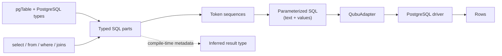

# qubu concept

> A working hypothesis about the package's direction, inferred from the current source and tests. It describes the intended character of qubu, not a claim that the implementation is complete.

## One-sentence vision

**qubu is a PostgreSQL-native, functional-first SQL builder for TypeScript that sits between raw SQL and a full ORM: SQL remains visible and explicit, while table definitions and composition provide strong static types and safe parameter handling.**

The intended experience is that someone who knows SQL can predict what qubu will emit, while TypeScript catches mistakes in names, nullability, aliases, and result shapes before a query reaches the database.

## The mental model

A query is not assembled by concatenating strings. It is assembled from SQL parts: table definitions, values, expressions, clauses, subqueries, and complete statements. Those parts retain enough metadata for both rendering and type inference.



This model has four important layers:

1. **Definitions** — `pgTable()` and PostgreSQL type helpers describe tables, columns, nullability, constraints, and encoding/decoding boundaries.
2. **Composition** — functions such as `select()`, `from()`, `where()`, `is()`, joins, aggregate helpers, aliases, and subqueries return reusable SQL fragments.
3. **Tokenization and rendering** — fragments become token sequences. Values become positional parameters, identifiers are escaped, and only an explicit `unsafe()` escape hatch emits raw syntax.
4. **Execution** — a small adapter boundary connects the rendered query to a driver. The query builder itself does not need to know whether the driver is Bun, Node Postgres, or another PostgreSQL client.

The central abstraction is therefore: **everything is a composable SQL fragment, but not every fragment is executable by itself.** Expressions and clauses need a statement around them; a `Query` is an executable statement; an aliased query can become a table-like source for another query.

## Likely values

### 1. SQL fidelity over abstraction for its own sake

The API should mirror SQL rather than replace it with a separate object-oriented vocabulary. `select`, `from`, `where`, `distinct`, `orderBy`, `caseWhen`, aggregates, and joins correspond directly to SQL concepts. PostgreSQL features are acceptable when they make the database more useful; hiding PostgreSQL behind a lowest-common-denominator dialect is not the goal.

### 2. Explicitness and zero magic

The caller chooses the tables, columns, aliases, predicates, and subqueries. There should be no implicit relationship traversal, automatic joins, lazy loading, identity map, or hidden query generation. A query should be traceable from the TypeScript expression to the SQL it emits.

This also explains the functional-first shape: standalone clause functions compose visibly, while methods are reserved for operations that naturally belong to a fragment, such as aliasing an expression or selecting sort direction.

### 3. Type safety as a primary feature

Types are not merely annotations around a string builder. A table definition carries column input/output types and nullability. A projection determines the inferred row shape. Aliases become property names, table aliases remap column references, wildcards can omit fields, and derived queries expose their selected columns.

The desired guarantee is not that every possible SQL rule can be encoded in TypeScript. It is that common errors—wrong field names, forgotten aliases, invalid result assumptions, and lost nullability—are made difficult without making ordinary SQL cumbersome.

### 4. Safety by default, with an honest escape hatch

User values should be bound as parameters, not interpolated into SQL. Identifiers should be escaped and quoted when necessary. The token model and positional parameter rendering support that default.

Raw syntax still has a place for PostgreSQL's long tail, but it should be conspicuous and deliberate through `unsafe()` or `sql.unsafe()`. Extensibility must not be confused with safety: once a caller supplies raw syntax, the caller owns its correctness and security.

### 5. Small, inspectable machinery

The token sequence is intentionally simpler than a large query AST, while still preserving nested sequences, delimiters, identifiers, parameters, and subqueries. Flattening compatible sequences reduces unnecessary structure and makes generated SQL easier to inspect. `SQL.Query.toString()` is a first-class debugging and testing surface, not an incidental implementation detail.

### 6. A thin database boundary

The core should build and render queries; adapters should handle connection and driver-specific execution. This keeps the package useful for SQL generation without forcing one client library, and lets a driver determine how PostgreSQL values such as dates, byte arrays, and timestamps are represented.

### 7. Composition before convenience APIs

A small set of reliable primitives is more valuable than a large collection of specialized helpers. New features should earn their place by expressing common SQL more safely or more clearly than user-land composition would. The existing support for custom primitives, custom decoders, operator registries, and `unsafe` syntax suggests that extension points are preferable to hard-coding every PostgreSQL feature in the core.

## What the package is probably for

A typical user should be able to:

- declare a query-facing PostgreSQL schema once;
- write a readable, SQL-shaped query with functional clauses;
- use ordinary JavaScript values without manually numbering parameters;
- compose expressions, predicates, aggregates, aliases, and subqueries;
- inspect the exact SQL and parameter list before execution;
- execute through their preferred PostgreSQL client; and
- receive a result whose TypeScript shape follows the selected columns.

For example, the current direction supports a shape like this:

```ts
const users = pgTable('users', {
  id: uuid().primaryKey(),
  name: text(),
})

const userId = '...'
const query = select(
  {
    id: users.id,
    displayName: users.name,
  },
  from(users),
  where(is(users.id, '=', userId))
)

const [text, values] = SQL.Query.toString(query)
// text:   select users.id, users.name as "displayName" from users where users.id = $1
// values: [userId]

const rows = await db.query(query)
```

The important part is not this particular convenience. It is that the TypeScript expression, the rendered SQL, the bound values, and the inferred result all remain connected and understandable.

## Boundaries and non-goals

The likely boundary of qubu is query construction and execution, not application data modeling. It should not become responsible for:

- ORM relationship management, lazy loading, change tracking, or object identity;
- schema migrations or database lifecycle management;
- hiding PostgreSQL-specific behavior behind a portable dialect;
- automatically deciding which rows or relationships a query should touch; or
- requiring runtime validation for every value when compile-time typing and an explicit escape hatch are sufficient.

Runtime decoding and Standard Schema support may still be useful, especially for JSON and driver-dependent types. They should remain explicit and composable rather than turning the query builder into an opaque validation framework.

## Current maturity signals

The direction is clearer than the implementation is complete.

- The strongest center of gravity is typed `SELECT`: table and column definitions, aliases, wildcards, object projections, distinct variants, basic aggregates, predicates, subqueries, and SQL snapshots are represented.
- The token renderer already expresses the core safety model: values are parameters and identifiers are handled separately from raw syntax.
- A generic client and a Bun adapter demonstrate the intended execution boundary.
- Insert construction is only partial, while update and delete modules are still empty and conflict actions are placeholders.
- Many tests for joins, mutations, parameter binding, SQL rendering, chaining, and edge cases are deliberately skipped. The test names are useful as a statement of the desired surface, but not evidence that those features work today.
- Decoder metadata, Standard Schema attachment, and result mapping point toward a richer runtime type story, but that story is not yet fully wired through execution.

These gaps do not undermine the concept; they identify where the implementation has not yet caught up with it. The package should be judged by whether future work preserves the same directness, type clarity, and safety rather than by how many helpers it accumulates.

## Design questions to keep visible

1. **Static types versus runtime decoding:** How much should adapters and query results participate in decoding and validation, and what remains a compile-time-only promise?
2. **Mutation safety:** Should update/delete operations without a `WHERE` clause be allowed freely, require an explicit opt-in, or only warn? The skipped tests suggest this deserves a deliberate policy.
3. **Mutation versus reuse:** SQL fragments currently expose mutating append-style operations. The eventual semantics for reusing or branching a query should be clear before a fluent builder grows around them.
4. **Coverage versus composability:** PostgreSQL has a large syntax surface. The project should continue adding primitives where they improve common safety and ergonomics, while leaving uncommon syntax expressible through composition or `unsafe()`.

## Definition of success

qubu succeeds when a developer can write PostgreSQL that still looks and behaves like PostgreSQL, but gains three things raw strings do not provide: **predictable parameterization, useful compiler feedback, and a transparent path from source expression to executed query**. It should feel less like an ORM and more like a typed, composable representation of SQL.
