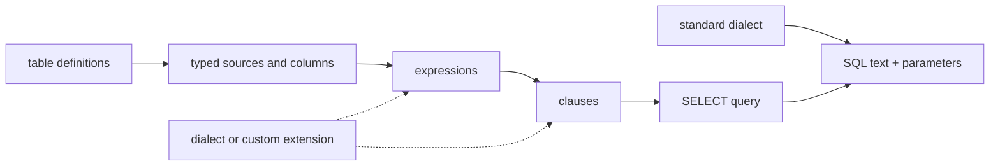

# qubu fundamentals

qubu is a functional-first, type-safe SQL `SELECT` builder for TypeScript. The core targets standard SQL; PostgreSQL and other database differences are explicit dialect or adapter extensions.

## The central abstraction

Everything that can be composed is a fragment. A fragment has:

- a small renderer that writes SQL and parameters;
- a single metadata type containing whichever semantic facts apply;
- a result type when it produces a value or row;
- source requirements for its valid scope; and
- nullability facts when an outer join can affect its result.

Conceptually:

```ts
Fragment<Metadata>
```

The metadata is a union of tagged facts such as `ResultMeta<Output>`,
`RequiresSourceMeta<Source>`, and `NullableSourceMeta<Source>`. Composition
helpers distribute over that union and retain the source and nullability facts
that later clauses need. Parameter values remain a runtime concern of the
renderer rather than a fourth compile-time contract.

The runtime representation is intentionally not a large mutable AST. Small primitives compose renderer functions, while the metadata union carries the semantic consequences that TypeScript needs.



## Values first

Tables are declared once and reused as values:

```ts
const users = table('users', {
  id: integer(),
  name: text(),
  email: text({ nullable: true }),
})
```

The table value exposes typed column references. A projection determines the result row type, and aliases, derived tables, and CTEs expose their selected fields to later queries.

```ts
const query = select(
  {
    id: users.id,
    name: users.name,
  },
  from(users),
  where(eq(users.id, 42))
)

const result = render(query)
// result.text: SELECT "users"."id" AS "id", "users"."name" AS "name" ...
// result.parameters: [42]
```

## Composition rules

- Functions return fragments rather than mutating a shared builder.
- Clauses can be created independently and supplied to `select` in any order; the query renderer emits standard SQL order.
- Source requirements accumulate through expressions, predicates, projections, joins, and subqueries; `leftJoin` also marks its source as nullable for the selected output.
- The select projection establishes the row shape that derived sources and scalar subqueries consume.
- Repeated conditions or ordering terms are composed explicitly with `and`, `or`, and one `orderBy` clause rather than hidden mutation.
- `customClause` and custom fragments are public extension points; unusual syntax does not need a new global registry.

## Standard core and dialect extensions

The standard dialect owns identifier quoting and `?` placeholders. A PostgreSQL dialect can change placeholders to `$1`, `$2`, while PostgreSQL-specific operators or clauses remain separate modules. The core should expose the policy boundary without importing a database-specific vocabulary.

This is not dialect erasure: portable syntax is the default, and divergence is visible at the call site.

## Safety boundary

Values are parameters. Identifiers are quoted by the dialect. `unsafe` primitives are explicit and are the caller’s responsibility. Type-level checks focus on high-value mistakes—wrong field names, missing sources, aliases, nullability, and result shapes—rather than attempting to encode every SQL grammar rule.

The first-party schema helpers cover common application values: `timestamp`
and `dateTime` expose `Date`, `uuid` exposes `string`, `json<T>()` lets the
caller choose the decoded JSON shape, `bigint` exposes `bigint`, and `binary`
or `blob` expose `Uint8Array`. These helpers describe application input/output
types only; a driver or execution adapter remains responsible for encoding and
decoding database-specific representations.

Mutation input types come from the same definitions. `column<Output, Insert,
Update>()` can describe different application-facing read, insert, and update
values; `hasDefault: true` makes an insert field optional, `generated: true`
omits it from inserts and updates, and `nullable: true` permits explicit
`null` without confusing it with an omitted default.

## Scope boundary

The project owns query construction and rendering. It does not own ORM behavior, migrations, relationship loading, connection lifecycle, or hidden execution. Those concerns can consume the rendered query through separate adapters once the `SELECT` model is stable.
