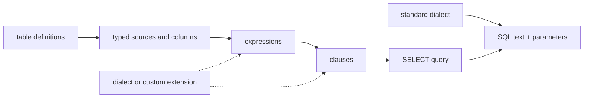

# Qubu fundamentals

Qubu is a functional-first, type-aware SQL builder for TypeScript. The root
entrypoint builds typed reads and writes, while optional entrypoints provide
introspection and pure schema tooling. The core targets standard SQL;
database-specific behavior stays in explicit dialect or adapter extensions.

## The central abstraction

Everything that can be composed is a fragment. A fragment has:

- a small renderer that writes SQL and parameters;
- a single metadata type containing whichever semantic facts apply;
- a result type when it produces a value or row;
- a query cardinality fact when its row count is soundly bounded; and
- source requirements for its valid scope; and
- nullability facts when an outer join can affect its result.

Conceptually:

```ts
Fragment<Metadata>
```

The metadata is a union of tagged facts such as `ResultMeta<Output>`,
`RequiresSourceMeta<Source>`, `RequiresOuterSourceMeta<Source>`,
`ProvidesOuterSourceMeta<Source>`, `NullableSourceMeta<Source>`,
`ProvidesSourceMeta<Source, Row>`,
`ExpressionMeta<Dependencies>`, `AggregateMeta<Dependencies>`,
`GroupingMeta<Keys, Dependencies>`, and `CardinalityMeta<QueryCardinality>`.
Composition helpers distribute over that union and retain the source,
nullability, and expression facts that later clauses need; aggregate
dependencies are marked as consumed, while grouping facts are consumed by
`select()` validation. `correlate()` consumes a `ProvidesOuterSourceMeta` fact
at the inner SELECT boundary and records only the actually used sources as
`RequiresOuterSourceMeta`; scalar, predicate, and LATERAL consumers validate
those requirements against the enclosing scope. Query cardinality is consumed
at the scalar-subquery boundary rather than leaking into ordinary expression
composition. Parameter values remain a runtime concern of the renderer rather
than a fourth compile-time contract.

The propagation rule is deliberately semantic rather than positional:
transparent composition preserves inherited non-result facts, source-aware
operators replace the result contract while carrying operand requirements, and
operators whose SQL guarantees a result shape or nullability state declare that
override explicitly. `leftJoin()` contributes nullable-source provenance;
selection consumes that provenance to widen only affected output fields.
`customSource()` contributes a source-provision fact, which `from()` and joins
consume before making the produced source available to later fragments.
Type-level regression tests protect these laws, including the distinction
between a nullable column, a nullable joined expression, and a result such as
`count()` or a null predicate that is not nullable merely because one operand
came from an outer join.

The runtime representation is intentionally not a large mutable AST. Small primitives compose renderer functions, while the metadata union carries the semantic consequences that TypeScript needs.



## Values first

Tables are declared once and reused as values:

```ts
const users = table('users', {
  id: integer(),
  name: text(),
  email: text({ nullable: true }),
})
```

The table value exposes typed column references. A projection determines the result row type, and aliases, derived tables, and CTEs expose their selected fields to later queries.

```ts
const query = select(
  {
    id: users.id,
    name: users.name,
  },
  from(users),
  where(eq(users.id, 42))
)

const result = render(query)
// result.text: SELECT "users"."id" AS "id", "users"."name" AS "name" ...
// result.parameters: [42]
```

## Composition rules

- Functions return fragments rather than mutating a shared builder.
- Clauses can be created independently and supplied to `select` in any order; the query renderer emits standard SQL order.
- Source requirements accumulate through expressions, predicates, projections, joins, and subqueries; `leftJoin` also marks its source as nullable for the selected output.
- Grouped projections, `HAVING`, and grouped `ORDER BY` expressions must expose only grouped dependencies or aggregate-consumed dependencies; functional dependencies are not inferred.
- The select projection establishes the row shape that derived sources and scalar subqueries consume.
- Query cardinality defaults to `many`; only sound limits or source-free
  row-preserving selects refine it, and `scalar()` uses that fact to preserve
  zero-row nullability.
- Repeated conditions or ordering terms are composed explicitly with `and`, `or`, and one `orderBy` clause rather than hidden mutation.
- `customClause` and custom fragments are public extension points; unusual syntax does not need a new global registry.

## Standard core and dialect extensions

The standard dialect owns identifier quoting and `?` placeholders. A PostgreSQL dialect can change placeholders to `$1`, `$2`, while PostgreSQL-specific operators or clauses remain separate modules. The core should expose the policy boundary without importing a database-specific vocabulary.

This is not dialect erasure: portable syntax is the default, and divergence is visible at the call site.

## Safety boundary

Values are parameters. Identifiers are quoted by the dialect. The `sql` tag
treats static template text as trusted syntax, binds ordinary substitutions,
and composes fragment substitutions through the active renderer. Dynamic
syntax and runtime identifiers remain behind explicit unsafe or identifier
helpers. Type-level checks focus on wrong field names, missing sources,
aliases, nullability, and result shapes. They do not attempt to encode every
SQL grammar rule.

The first-party schema helpers cover common application values: `timestamp`
and `dateTime` expose `Date`, `uuid` exposes `string`, `json<T>()` lets the
caller choose the decoded JSON shape, `bigint` exposes `bigint`, and `binary`
or `blob` expose `Uint8Array`. These helpers describe application input/output
types only; a driver or execution adapter remains responsible for encoding and
decoding database-specific representations.

Mutation input types come from the same definitions. `column<Output, Insert,
Update>()` can describe different application-facing read, insert, and update
values; `hasDefault: true` makes an insert field optional, `generated: true`
omits it from inserts and updates, and `nullable: true` permits explicit
`null` without confusing it with an omitted default.

## Scope boundary

The project owns query construction and rendering, snapshot serialization and
diffing, pure migration planning, and DDL emission. `execute()` passes a
rendered statement, query kind, and optional abort signal to an
application-owned adapter, then returns its `ExecutionResult` unchanged.
Catalog readers likewise use an application-owned connection interface.
Transactional clients scope typed callback execution through an adapter-owned
transaction.

Qubu does not own migration execution, ORM behavior, relationship loading,
connections, pools, transaction configuration or connection lifecycle, retries,
parameter encoding or row decoding, driver error translation, or database
lifecycle. The public [ownership map](../docs/reference/supported-surface.md#ownership-boundary)
defines each handoff.
