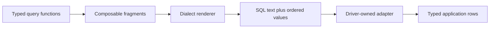

# Qubu MVP release

The MVP is the first release intended to serve many simple applications’
query-building needs. It keeps the functional fragment model small while
covering the complete read/write path from a typed statement to a driver-owned
execution adapter.

## What is included

- Parameterized, composable `SELECT` queries with projections, wildcards,
  joins, grouping, ordering, CTEs, subqueries, set operations, and source-scope
  diagnostics.
- Standard SQL rendering plus explicit PostgreSQL, SQLite, and MySQL dialect
  policies for identifiers, placeholders, and pagination. PostgreSQL also
  exposes the dialect-specific `ilike` expression.
- Schema helpers for common application values: dates/timestamps, UUIDs,
  caller-typed JSON, bigint, and binary values. Column metadata describes
  selectable output, insert input, update input, defaults, generated columns,
  and nullability.
- Typed `INSERT`, `UPDATE`, and `DELETE` statements with bound values,
  `DEFAULT VALUES`, multi-row `VALUES`, `INSERT ... SELECT`, source-aware
  assignments and predicates, and reusable typed `RETURNING` projections.
- NULL-safe equality: `eq(column, null)` and `ne(column, null)` render
  `IS NULL` and `IS NOT NULL`; invalid relational NULL comparisons are rejected.
  Empty `IN` and `NOT IN` lists render portable false/true predicates.
- A driver-neutral execution boundary. Adapters receive rendered SQL and
  ordered raw parameter values, then own driver encoding, row decoding,
  pooling, transactions, retries, and error types.
- An opt-in Vite compiler hint with matching ambient declarations for the
  public runtime catalog.

## Rendering and execution boundary

The compile-time parameter contract is a union of the value types accepted by
the composed fragments. Runtime rendering remains the authority for order;
`RenderedQuery.parameters` follows the placeholders in `RenderedQuery.text`.
This avoids claiming an ordered tuple that the renderer does not maintain at
the type level.

## Safety defaults

Values are bound parameters and identifiers are quoted through the dialect.
`UPDATE` and `DELETE` require a `WHERE` clause unless the caller explicitly
passes `allowAll()`. Raw SQL remains available only through the existing
explicit unsafe primitives. Adapter errors are not caught or rewritten by the
core.

## Deferred after MVP

- Dialect-aware `ON CONFLICT` upsert support.
- Recursive CTEs, `JOIN ... USING`, and lateral joins.
- Typed window-function composition and broader vendor-specific syntax.
- Schema introspection, migrations, ORM behavior, relationship loading,
  connection lifecycle, and transaction orchestration.
