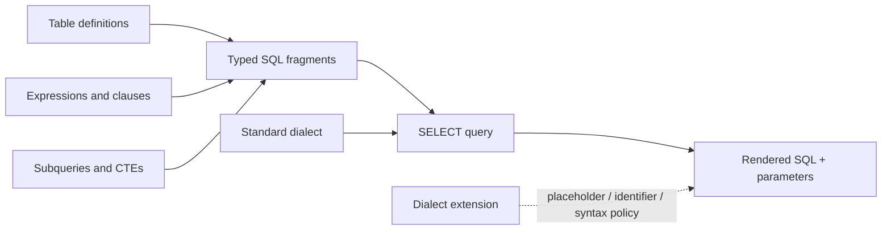

# qubu Vision & Mental Model

`qubu` is a functional-first, type-safe SQL `SELECT` builder for TypeScript. It starts with standard SQL and makes database-specific behavior explicit through dialect and adapter extension points.

## 1. The Core Philosophy

- **SQL fidelity:** If a developer knows SQL, the generated query should be predictable from the TypeScript expression.
- **Functional composition:** Tables, expressions, clauses, subqueries, and complete queries are values composed by small functions.
- **Simple primitives:** The core should expose fragments, identifiers, parameters, sequences, and dialects—not a mutable all-purpose query singleton.
- **Useful type information:** A fragment carries the semantic facts downstream composition needs: output shape, source requirements, and parameter types.
- **Explicit extension:** Standard SQL belongs in the core. PostgreSQL or other dialect differences belong in separate modules and custom primitives.
- **Safe by default:** Values are parameters and identifiers are escaped. Raw syntax requires an explicit escape hatch.

## 2. The Mental Model

A query is a composition of fragments. A fragment has a small runtime renderer and phantom type metadata:

```ts
Fragment<Output, RequiredSources, Parameters>
```

The renderer stays simple; the metadata changes as functions compose fragments. A `FROM` clause contributes sources, a projection determines the row shape, and expressions retain the sources and parameters they require.



The core layers are:

1. **Definitions** — table and column values describe query-facing names and TypeScript row values.
2. **Primitives** — fragments, identifiers, parameters, sequences, and explicit syntax form the smallest reusable units.
3. **Expressions** — comparisons, boolean logic, arithmetic, functions, aliases, and subqueries preserve type-level consequences.
4. **Clauses** — `from`, joins, `where`, grouping, ordering, pagination, CTEs, and other standard SQL pieces remain independent functions.
5. **Queries** — `select` assembles a projection and clauses, normalizes their SQL order, and exposes the inferred row type.
6. **Rendering** — a dialect supplies the small syntax decisions that cannot be universal, producing SQL text and bound parameters.

## 3. The Type Contract

The public API should be value-first:

```ts
const users = table('users', {
  id: integer(),
  name: text(),
  email: text({ nullable: true }),
})

const query = select(
  {
    id: users.id,
    displayName: users.name,
  },
  from(users),
  where(eq(users.id, 42))
)
```

The resulting query carries the row type `{ id: number; displayName: string }`. A column expression records which source it requires, so the builder can reject a projection or clause whose source is absent from the query scope. A derived table, CTE, alias, or subquery exposes its own typed columns for the next composition step.

The type system should model high-value relational facts—names, aliases, nullability, source scope, projection shape, and parameter requirements—without attempting to encode every detail of the SQL grammar. Exhaustive grammar modeling would work against the project’s ergonomics goal.

## 4. Dialects and Adapters

The standard builder owns portable SQL semantics. A dialect is a small policy object for rendering decisions such as identifier quoting and parameter placeholders. For example, the standard dialect uses `?`, while the optional PostgreSQL dialect uses `$1`, `$2`, and so on.

Dialect-specific clauses and expressions should be separate functions or custom fragments. The core must not quietly become PostgreSQL-shaped, and the standard layer must not pretend that divergent behavior is portable.

## 5. Extensibility Rules

Before adding a feature, ask:

1. Does it represent standard SQL or a documented dialect capability?
2. Can a user express it with existing fragments and `customClause`/`unsafeExpression`?
3. Does the feature preserve source requirements, output shape, parameterization, and rendering order?
4. Is a small primitive clearer than a new stateful builder abstraction?

Extensions should depend on public primitives rather than reach into a central query object. A custom expression or clause should be able to participate in rendering and type propagation without being registered in a global singleton.

## 6. Explicit Non-Goals

- ORM relationship management, lazy loading, change tracking, or identity maps.
- Schema migrations and database lifecycle management.
- A mutable global query builder or hidden execution behavior.
- Hiding meaningful differences between SQL dialects behind a lowest-common-denominator API.
- Implementing mutations before the `SELECT` model is stable and reusable.

## 7. Definition of Success

qubu succeeds when a developer can write a readable, standard SQL-shaped `SELECT` using ordinary functions; compose it from reusable fragments; receive compiler feedback for invalid source and result assumptions; inspect parameterized SQL before execution; and extend the builder for a dialect or uncommon SQL feature without modifying a central singleton.
