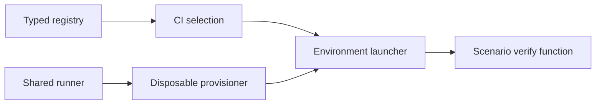

# Combo catalog

> This page is generated from `packages/combo-runner/src/catalog.ts`. Edit the typed registry, then run `pnpm catalog:generate`.

The combo library tracks one database-client adapter variant against each
runtime where someone might try to execute it. A combo is eligible for CI only
when its cell is `verified` and its scenario exports an async `verify`
function.

## Runtime flow

The registry supplies both the CI selection and the runtime/database choices.
The scenario owns schema setup, test data, and the Qubu query. The runner owns
the database lifetime.



## Adapter variants

There are exactly 7 engine-qualified adapter variants
and 5 environments, so the matrix contains
35 cells.

| ID | Adapter | Engine | Declared runtime |
| --- | --- | --- | --- |
| `node-sqlite` | node:sqlite | sqlite | Node.js |
| `pg-node` | pg | postgresql | Node.js |
| `mysql2-promise-node` | mysql2/promise | mysql | Node.js |
| `bun-sqlite` | Bun.SQL/SQLite | sqlite | Bun |
| `postgresjs-deno` | postgres.js | postgresql | Deno |
| `d1-workers` | D1 binding | sqlite | Cloudflare Workers |
| `pglite-browser` | PGlite | postgresql | browser |

## Status counts

| Status | Cells | Meaning |
| --- | ---: | --- |
| `verified` | 0 | A scenario exports `verify`, runs in the declared runtime, and completes a live round trip. |
| `experimental` | 13 | The pairing may be useful, but it is not part of the verified CI set. |
| `incompatible` | 15 | The engine-qualified adapter entry point cannot run in this environment. |
| `not-yet-written` | 7 | This is a planned pairing with no scenario module yet. |

## Complete matrix

Every adapter/environment pair appears below. The status is a planning fact,
not a promise that the runtime can load a package without a scenario.

| Adapter | Node.js | Bun | Deno | Cloudflare Workers | browser |
| --- | --- | --- | --- | --- | --- |
| `node-sqlite` | `not-yet-written` | `experimental` | `experimental` | `incompatible` | `incompatible` |
| `pg-node` | `not-yet-written` | `experimental` | `experimental` | `incompatible` | `incompatible` |
| `mysql2-promise-node` | `not-yet-written` | `experimental` | `experimental` | `incompatible` | `incompatible` |
| `bun-sqlite` | `incompatible` | `not-yet-written` | `incompatible` | `incompatible` | `incompatible` |
| `postgresjs-deno` | `experimental` | `experimental` | `not-yet-written` | `experimental` | `incompatible` |
| `d1-workers` | `incompatible` | `incompatible` | `incompatible` | `not-yet-written` | `incompatible` |
| `pglite-browser` | `experimental` | `experimental` | `experimental` | `experimental` | `not-yet-written` |

## Verification targets

The target cells are currently pending because scenario modules land in later
commits. Incompatible and experimental cells stay in the complete matrix so a
new scenario cannot be added without an explicit status change.

| Adapter | Runtime | Status | Scenario |
| --- | --- | --- | --- |
| `node-sqlite` | Node.js | `not-yet-written` | pending |
| `pg-node` | Node.js | `not-yet-written` | pending |
| `mysql2-promise-node` | Node.js | `not-yet-written` | pending |
| `bun-sqlite` | Bun | `not-yet-written` | pending |
| `postgresjs-deno` | Deno | `not-yet-written` | pending |
| `d1-workers` | Cloudflare Workers | `not-yet-written` | pending |
| `pglite-browser` | browser | `not-yet-written` | pending |

## Commands

Install the workspace and run its deterministic checks:

```bash
pnpm install
pnpm check
```

Regenerate this page after a registry edit:

```bash
pnpm catalog:generate
```

Print the JSON matrix that CI will execute. At this foundation commit it has
an empty `include` list because no scenario has been written yet:

```bash
pnpm ci:matrix
```

## Adding a verified scenario

Add a module under `packages/combo-runner/src/scenarios/` that exports one
async `verify(context)` function. The function should prepare its own small
schema and data, execute a bound Qubu query, assert the returned rows, and
clean up scenario-owned objects. Then add its module specifier to the target
cell, change that cell to `verified`, and provide the matching launcher and
provisioner in the CI runtime.
