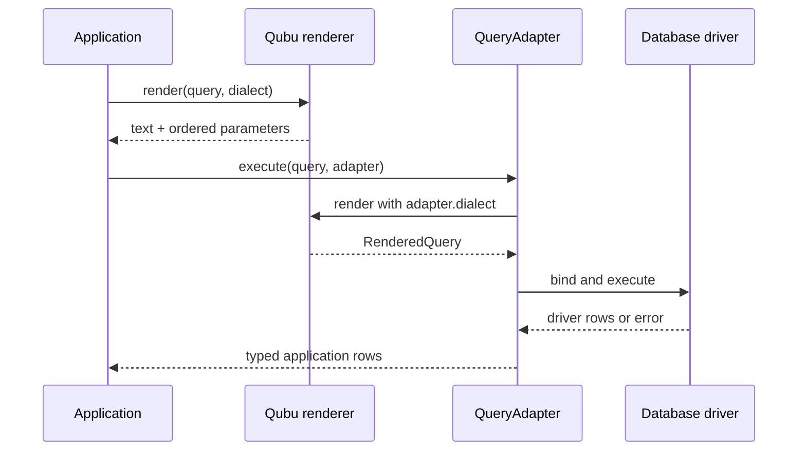

# Dialects and execution

> Keep portable query construction separate from placeholder, identifier, pagination, cast-target, and driver decisions at the rendering boundary.

## Render once, choose a policy at the boundary

`render()` returns a `RenderedQuery` with SQL text and raw parameter values. The
default is `standardDialect()`:

| Dialect      | Import              | Identifiers   | Placeholders    | Pagination policy                     |
| ------------ | ------------------- | ------------- | --------------- | ------------------------------------- |
| Standard SQL | `standardDialect()` | double quotes | `?`             | `OFFSET ... ROWS FETCH ... ROWS ONLY` |
| PostgreSQL   | `postgresDialect()` | double quotes | `$1`, `$2`, ... | `LIMIT ... OFFSET ...`; `ILIKE`       |
| SQLite       | `sqliteDialect()`   | double quotes | `?`             | `LIMIT ... OFFSET ...`                |
| MySQL        | `mysqlDialect()`    | backticks     | `?`             | `LIMIT ... OFFSET ...`                |

Construct the query without choosing a driver, then render it with the policy
the adapter expects:

```ts
const standard = render(query)
const postgres = render(query, postgresDialect())

standard.text
// ... WHERE ("users"."id" = ?)

postgres.text
// ... WHERE ("users"."id" = $1)
```

## Capability requirements

Portable syntax stays portable, while dialect-specific syntax carries a
capability requirement to the rendering boundary. PostgreSQL's `ilike()` is
the first such feature:

```ts
const postgresQuery = select(
  { name: users.name },
  from(users),
  where(ilike(users.name, '%ada%'))
)

render(postgresQuery, postgresDialect()) // supported
render(postgresQuery, sqliteDialect()) // TypeScript error
```

The same check runs at runtime when a dialect or query has been widened or
received from an untyped integration. Use the portable operator when the
query must render across dialects:

```ts
const portableQuery = select(
  { name: users.name },
  from(users),
  where(like(users.name, '%ada%'))
)

render(portableQuery)
render(portableQuery, sqliteDialect())
```

Custom dialects that implement a supported capability advertise it through
`createDialect({ capabilities: ['ilike'] })`. A dialect without that
advertisement is rejected for capability-bearing fragments.

Import `ilike` from `qubu/postgres` or the package root when the query requires
PostgreSQL behavior.

## The adapter owns the driver

Qubu does not open connections, bind values for a particular client, decode
rows, or manage transactions. An adapter receives the rendered statement and
returns application rows:

```ts
import { execute, postgresDialect } from 'qubu'
import type { QueryAdapter } from 'qubu'

declare const client: {
  query(
    text: string,
    parameters: readonly unknown[]
  ): Promise<{ rows: readonly object[] }>
}

const adapter: QueryAdapter = {
  dialect: postgresDialect(),
  async execute<TRow extends object>(statement) {
    const result = await client.query(statement.text, statement.parameters)
    return result.rows as readonly TRow[]
  },
}

const rows = await execute(query, adapter)
```

The adapter's `dialect` becomes the default for `execute()`. Pass a render
option only when the execution call needs to override that policy. Driver error
types and transaction behavior pass through the adapter boundary unchanged.



## Create a small custom dialect

Use `createDialect()` when a driver needs a different policy but the query
syntax stays portable:

```ts
import { createDialect, render } from 'qubu'

const namedParameters = createDialect({
  name: 'named-parameters',
  placeholder: position => `:p${position}`,
  castTypes: { text: 'STRING' },
})

const statement = render(query, namedParameters)
// ... WHERE ("users"."id" = :p1)
```

`castTypes` overrides how logical targets from definitions such as `text()`
render in `CAST` expressions. Omitted entries use the standard spelling. A
custom definition's explicit `castType` is emitted verbatim instead of passing
through this map.

For syntax that is not a small policy decision, add a [custom fragment or
clause](../guides/extensions.md) instead of making the standard dialect
pretend that vendor behavior is portable.

> [!WARNING]
> `RenderedQuery.parameters` contains raw application values. The adapter must
> bind or encode them using the driver API; do not concatenate them into
> `RenderedQuery.text`.
