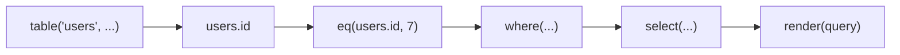

# Fragments and source scope

> Understand the small value model behind Qubu and use compiler feedback to catch columns that are outside a query's relational scope.

## A query is composed from fragments

The runtime unit is a `Fragment` with a renderer and one metadata type:

```ts
Fragment<Metadata>
```

The renderer appends SQL and parameters to a context. `Metadata` is a union of
tagged facts that later composition needs:

- `ResultMeta<Output, NullableFrom>` describes the value or row produced by
  an expression or query, and which outer-joined sources can make that result
  `null`.
- `RequiresSourceMeta<Source>` identifies a table, alias, CTE, or derived query
  that must be available before the fragment is valid.
- `NullableSourceMeta<Source>` records that a source was introduced by a
  nullable join.

Not every fragment needs to contribute every fact. Composition helpers such as
`sequence()` preserve the non-result metadata of their children, so a custom
fragment can remain source-aware without inventing a separate generic for each
kind of information.

This keeps the runtime core small. Qubu does not require extensions to build or
register nodes in a central mutable AST.



## Source requirements accumulate

A table column remembers the source that provides it. The projection, each
clause, and each nested expression contributes its required sources to the
query's scope. A missing source is therefore reported at composition time:

```ts
import { from, integer, select, table, text } from 'qubu'

const users = table('users', {
  id: integer(),
})
const posts = table('posts', {
  id: integer(),
  title: text(),
})

select({ id: users.id }, from(posts))
// Type error: users is not available in this query scope
```

Add the source that owns the column, or join it with a predicate that refers to
both sources:

```ts
import { eq, from, innerJoin, integer, select, table } from 'qubu'

const users = table('users', {
  id: integer(),
})
const posts = table('posts', {
  id: integer(),
  authorId: integer(),
})

const query = select(
  { userId: users.id, postId: posts.id },
  from(users),
  innerJoin(posts, eq(users.id, posts.authorId))
)
```

Aliases, CTEs, and derived queries expose new source identities. Use the
exposed columns from the new source rather than continuing to use columns from
the source that was wrapped.

## Output shape is part of composition

An object projection names the row fields directly. An aliased expression adds
the alias to the result shape:

```ts
import {
  aliasExpression,
  from,
  integer,
  select,
  table,
  text,
  upper,
} from 'qubu'

const users = table('users', {
  id: integer(),
  name: text(),
})

const query = select(
  {
    id: users.id,
    displayName: aliasExpression(upper(users.name), 'displayName'),
  },
  from(users)
)

type Row = typeof query.row
// { id: number; displayName: string }
```

That row shape becomes the public column surface when the query is used as a
derived table or CTE. The same selection can also be reused in `RETURNING`.

## Nullable joins affect selected output

`leftJoin()` records the joined source as nullable. Selecting a column from that
source therefore widens the selected field, while expressions with a
non-nullable result contract such as `count()` can keep their result type:

```ts
import { aliasExpression, count, eq, from, leftJoin, select } from 'qubu'

const query = select(
  {
    userName: users.name,
    postTitle: posts.title,
    postCount: aliasExpression(count(posts.id), 'postCount'),
  },
  from(users),
  leftJoin(posts, eq(users.id, posts.authorId))
)

type Row = typeof query.row
// { userName: string; postTitle: string | null; postCount: number }
```

## Parameters remain a runtime concern

Parameter values are intentionally not part of fragment metadata. A renderer
calls `context.parameter(value)`, and `render()` collects those values in SQL
placeholder order. This keeps the type model focused on relational facts while
preserving the observable runtime behavior:

Rendering remains the authority for order:

```ts
import {
  and,
  eq,
  from,
  integer,
  like,
  render,
  select,
  table,
  text,
  where,
} from 'qubu'

const users = table('users', {
  id: integer(),
  name: text(),
})

const query = select(
  { id: users.id },
  from(users),
  where(and(eq(users.id, 7), like(users.name, '%Ada%')))
)

render(query)
// text:       ... WHERE (("users"."id" = ?) AND ("users"."name" LIKE ?))
// parameters: [7, '%Ada%']
```

The `parameters` array follows the placeholders in `text`, even when clauses
were passed to `select()` in a different order. Use `sequence()` or another
composition helper when a reusable fragment needs to preserve source or
nullability metadata; no call-site `as const` assertion is needed.

## Keep the boundary explicit

The type system focuses on high-value relational facts: source scope, selected
fields, and nullability. It does not attempt to encode every vendor-specific
grammar rule. Use the standard fragments for portable SQL and move intentional
divergence to [dialects or custom extensions](dialects-and-execution.md).
