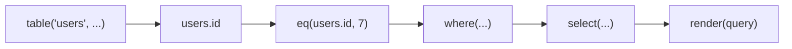

# Fragments and source scope

> Understand the small value model behind Qubu and use compiler feedback to catch columns that are outside a query's relational scope.

## A query is composed from fragments

The runtime unit is a `Fragment` with a renderer and one metadata type:

```ts
Fragment<Metadata>
```

The renderer appends SQL and parameters to a context. `Metadata` is a union of
tagged facts that later composition needs:

- `ResultMeta<Output, NullableFrom>` describes the value or row produced by
  an expression or query, and which outer-joined sources can make that result
  `null`.
- `RequiresSourceMeta<Source>` identifies a table, alias, CTE, or derived query
  that must be available before the fragment is valid.
- `NullableSourceMeta<Source>` records that a source was introduced by a
  nullable join.
- `ExpressionMeta<Dependencies>` records the columns an expression reads at
  the current query level.
- `AggregateMeta<Dependencies>` records dependencies consumed inside an
  aggregate, so they do not become ungrouped projection dependencies.
- `GroupingMeta<Keys, Dependencies>` records the grouping keys and the direct
  column dependencies made available by `GROUP BY`.
- `CardinalityMeta<QueryCardinality>` describes how many rows a query can
  return: `many`, `zero-or-one`, or `exactly-one`.

Cardinality is a query-result fact rather than an expression fact. Ordinary
source-backed selects default to `many`; a literal `FETCH`/`LIMIT` bound of
zero or one records `zero-or-one`, and a source-free select without a
row-reducing clause is `exactly-one`.

Not every fragment needs to contribute every fact. Composition helpers such as
`sequence()` preserve the non-result metadata of their children, so a custom
fragment can remain source-aware without inventing a separate generic for each
kind of information.

### Metadata propagation laws

The metadata union is additive, but result metadata is special: a fragment can
replace its children's result contract when it changes the SQL meaning of the
expression. The current laws are:

| Fragment shape                                                      | Metadata behavior                                                                                                                                                                                                                       |
| ------------------------------------------------------------------- | --------------------------------------------------------------------------------------------------------------------------------------------------------------------------------------------------------------------------------------- |
| `sequence()`, `commaSeparated()`, `keyword()`, and `parenthesize()` | Preserve inherited non-result facts such as source requirements and nullable-source facts. They do not invent an output type or leak query cardinality into an expression.                                                              |
| An expression wrapper such as `expressionFragment()`                | Preserve the wrapped expression's complete metadata, including its output type.                                                                                                                                                         |
| A source-aware expression such as `upper(column)`                   | Produce a new result type while inheriting the source requirements and nullable-source provenance of its operands.                                                                                                                      |
| An expression wrapper or operator                                   | Carry its current-level column dependencies forward; aggregate children also carry an aggregate-consumed dependency fact.                                                                                                               |
| An aggregate such as `count(column)`                                | Mark its argument dependencies as aggregate-consumed, so the aggregate itself is valid without grouping those columns.                                                                                                                  |
| `groupBy()`                                                         | Record its grouping expressions and, for column keys, the column dependencies that derived expressions may use.                                                                                                                         |
| `leftJoin()`                                                        | Inherit the join predicate's source requirements and add `NullableSourceMeta` for the joined source.                                                                                                                                    |
| Nullability-changing operators                                      | Declare their result nullability explicitly. `count()`, `countDistinct()`, `coalesce()` with its current contract, `caseWhen()` branches, and `IS NULL`/`IS NOT NULL` predicates do not blindly copy an operand's nullable-source fact. |

The corresponding type-level contract is intentionally narrow: `OutputOf<T>`
describes a concrete result, `RequiresOf<T>` describes sources that must be in
scope, and `NullabilityOf<T>` describes sources that can turn that result into
`null` after an outer join. Future metadata belongs in this union only when a
producer, a consumer, and regression coverage exist for it.

Grouped queries use the dependency facts when a `GROUP BY` or `HAVING` clause
is present, or when a projection contains an aggregate. A visible column
dependency must be one of the grouped column dependencies; aggregate arguments
are consumed by the aggregate and do not need to be grouped. Non-column group
expressions are accepted as exact grouping keys only. Qubu does not infer
functional dependencies from keys or database constraints.

This keeps the runtime core small. Qubu does not require extensions to build or
register nodes in a central mutable AST.



## Source requirements accumulate

A table column remembers the source that provides it. The projection, each
clause, and each nested expression contributes its required sources to the
query's scope. A missing source is therefore reported at composition time:

```ts
import { from, integer, select, table, text } from 'qubu'

const users = table('users', {
  id: integer(),
})
const posts = table('posts', {
  id: integer(),
  title: text(),
})

select({ id: users.id }, from(posts))
// Type error: users is not available in this query scope
```

Add the source that owns the column, or join it with a predicate that refers to
both sources:

```ts
import { eq, from, innerJoin, integer, select, table } from 'qubu'

const users = table('users', {
  id: integer(),
})
const posts = table('posts', {
  id: integer(),
  authorId: integer(),
})

const query = select(
  { userId: users.id, postId: posts.id },
  from(users),
  innerJoin(posts, eq(users.id, posts.authorId))
)
```

Aliases, CTEs, and derived queries expose new source identities. Use the
exposed columns from the new source rather than continuing to use columns from
the source that was wrapped.

## Output shape is part of composition

An object projection names the row fields directly. An aliased expression adds
the alias to the result shape:

```ts
import {
  aliasExpression,
  from,
  integer,
  select,
  table,
  text,
  upper,
} from 'qubu'

const users = table('users', {
  id: integer(),
  name: text(),
})

const query = select(
  {
    id: users.id,
    displayName: aliasExpression(upper(users.name), 'displayName'),
  },
  from(users)
)

type Row = typeof query.row
// { id: number; displayName: string }
```

That row shape becomes the public column surface when the query is used as a
derived table or CTE. The same selection can also be reused in `RETURNING`.

## Cardinality reaches scalar subqueries

`scalar()` includes `null` when its query may return no rows. This is true for
ordinary selects and remains true for a query limited to one row, because a
limit proves an upper bound but not the presence of a row:

```ts
import { fetchFirst, from, scalar, select, value } from 'qubu'

const firstUser = select({ id: users.id }, from(users), fetchFirst(1))

const firstId = scalar(firstUser)
// OutputOf<typeof firstId> is number | null
```

A source-free select has one row unless a known row-reducing clause is present,
so its scalar result can remain non-null:

```ts
const constant = select({ value: value(42) })
const constantValue = scalar(constant)
// OutputOf<typeof constantValue> is number
```

Qubu does not infer exactness from arbitrary predicates such as `WHERE id = 1`.
Those predicates can match no rows, and conservative cardinality keeps scalar
nullability honest without changing source-scope or rendering behavior.

## Nullable joins affect selected output

`leftJoin()` records the joined source as nullable. Selecting a column from that
source therefore widens the selected field, while expressions with a
non-nullable result contract such as `count()` can keep their result type:

```ts
import { aliasExpression, count, eq, from, leftJoin, select } from 'qubu'

const query = select(
  {
    userName: users.name,
    postTitle: posts.title,
    postCount: aliasExpression(count(posts.id), 'postCount'),
  },
  from(users),
  leftJoin(posts, eq(users.id, posts.authorId))
)

type Row = typeof query.row
// { userName: string; postTitle: string | null; postCount: number }
```

The same rule applies to expression semantics: `upper(posts.title)` remains
nullable because it depends on the joined row, while a count or a predicate
has a result contract that is independent of whether that row exists. A
fallback expression such as `coalesce(posts.title, value('untitled'))` and a
`CASE` expression with non-null branches likewise expose a non-null result.

## Parameters remain a runtime concern

Parameter values are intentionally not part of fragment metadata. A renderer
calls `context.parameter(value)`, and `render()` collects those values in SQL
placeholder order. This keeps the type model focused on relational facts while
preserving the observable runtime behavior:

Rendering remains the authority for order:

```ts
import {
  and,
  eq,
  from,
  integer,
  like,
  render,
  select,
  table,
  text,
  where,
} from 'qubu'

const users = table('users', {
  id: integer(),
  name: text(),
})

const query = select(
  { id: users.id },
  from(users),
  where(and(eq(users.id, 7), like(users.name, '%Ada%')))
)

render(query)
// text:       ... WHERE (("users"."id" = ?) AND ("users"."name" LIKE ?))
// parameters: [7, '%Ada%']
```

The `parameters` array follows the placeholders in `text`, even when clauses
were passed to `select()` in a different order. Use `sequence()` or another
composition helper when a reusable fragment needs to preserve source or
nullability metadata; no call-site `as const` assertion is needed.

## Keep the boundary explicit

The type system focuses on high-value relational facts: source scope, selected
fields, and nullability. It does not attempt to encode every vendor-specific
grammar rule. Use the standard fragments for portable SQL and move intentional
divergence to [dialects or custom extensions](dialects-and-execution.md).
