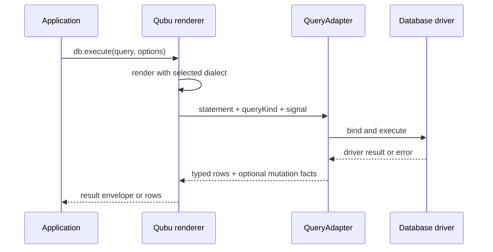

# Dialects and execution

> Keep portable query construction separate from placeholder, identifier, pagination, cast-target, and driver decisions at the rendering boundary.

## Render once, choose a policy at the boundary

`render()` returns a `RenderedQuery` with SQL text and raw parameter values. The
default renderer uses Qubu's standard SQL policy. Select a concrete dialect
subpath when a driver needs another placeholder, identifier, pagination, or
capability policy:

| Dialect      | Import              | Identifiers   | Placeholders    | Pagination policy                     |
| ------------ | ------------------- | ------------- | --------------- | ------------------------------------- |
| Standard SQL | `render(query)`     | double quotes | `?`             | `OFFSET ... ROWS FETCH ... ROWS ONLY` |
| PostgreSQL   | `postgresDialect()` | double quotes | `$1`, `$2`, ... | `LIMIT ... OFFSET ...`; `ILIKE`       |
| SQLite       | `sqliteDialect()`   | double quotes | `?`             | `LIMIT ... OFFSET ...`                |
| MySQL        | `mysqlDialect()`    | backticks     | `?`             | `LIMIT ... OFFSET ...`                |

Construct the query without choosing a driver, then render it with the policy
the adapter expects:

```ts
import { render } from 'qubu'
import { postgresDialect } from 'qubu/postgres'

const standard = render(query)
const postgres = render(query, postgresDialect())

standard.text
// ... WHERE ("users"."id" = ?)

postgres.text
// ... WHERE ("users"."id" = $1)
```

## Capability requirements

Portable syntax stays portable, while dialect-specific syntax carries a
capability requirement to the rendering boundary. PostgreSQL's `ilike()` is
the first such feature:

```ts
import { from, like, render, select, where } from 'qubu'
import { ilike, postgresDialect } from 'qubu/postgres'
import { sqliteDialect } from 'qubu/sqlite'

const postgresQuery = select(
  { name: users.name },
  from(users),
  where(ilike(users.name, '%ada%'))
)

render(postgresQuery, postgresDialect()) // supported
render(postgresQuery, sqliteDialect()) // TypeScript error
```

The same check runs at runtime when a dialect or query has been widened or
received from an untyped integration. Use the portable operator when the
query must render across dialects:

```ts
import { from, like, render, select, where } from 'qubu'
import { sqliteDialect } from 'qubu/sqlite'

const portableQuery = select(
  { name: users.name },
  from(users),
  where(like(users.name, '%ada%'))
)

render(portableQuery)
render(portableQuery, sqliteDialect())
```

Custom dialects that implement a supported capability advertise it through
`createDialect({ capabilities: ['ilike'] })`. A dialect without that
advertisement is rejected for capability-bearing fragments.

Import `ilike` and `postgresDialect` from `qubu/postgres`. The root entrypoint
does not re-export concrete dialect constructors.

## The adapter owns the driver

Qubu does not open connections, bind values for a particular client, decode
rows, or manage transactions. An adapter receives an `ExecutionRequest` and
returns an `ExecutionResult`:

```ts
import { qubu } from 'qubu'
import { postgresDialect } from 'qubu/postgres'
import type { ExecutionRequest, ExecutionResult, QueryAdapter } from 'qubu'

declare const driver: {
  query<TRow extends object>(
    text: string,
    parameters: readonly unknown[],
    options: { signal?: AbortSignal }
  ): Promise<{ rows: readonly TRow[]; rowCount: number | null }>
}

const adapter: QueryAdapter = {
  dialect: postgresDialect(),
  async execute<TRow extends object>(request: ExecutionRequest) {
    const { statement, queryKind, signal } = request
    const result = await driver.query<TRow>(
      statement.text,
      statement.parameters,
      { signal }
    )
    return {
      rows: result.rows,
      ...(queryKind !== 'select' &&
      queryKind !== 'set' &&
      result.rowCount !== null
        ? { affectedRows: result.rowCount }
        : {}),
    } satisfies ExecutionResult<TRow>
  },
}
```

## Bind the adapter once

Use `qubu()` when several calls share one adapter. The returned client keeps
the adapter available as `db.adapter` and accepts the same execution options as
the standalone functions:

```ts
const db = qubu(adapter)

const controller = new AbortController()
const result = await db.execute(query, {
  signal: controller.signal,
})

result.rows
result.affectedRows

const rows = await db.rows(readQuery)
```

`db.execute()` returns the structured result. `db.rows()` returns only its row
array. Both methods infer each row from the query projection. They do not make
query values executable or transfer connection ownership to Qubu.

The standalone functions remain useful when the adapter varies by call or a
small module does not need a bound client:

```ts
import { execute, executeRows } from 'qubu'

const result = await execute(query, adapter)
const rows = await executeRows(readQuery, adapter)
```

| Result field   | Type                         | Adapter contract                                                                      |
| -------------- | ---------------------------- | ------------------------------------------------------------------------------------- |
| `rows`         | `readonly TRow[]`            | Always present; use an empty array for a mutation without returned rows               |
| `affectedRows` | `number \| bigint`           | Rows inserted, updated, or deleted when the driver reports an affected count          |
| `changedRows`  | `number \| bigint`           | Rows whose stored values changed when the driver distinguishes them from matched rows |
| `insertId`     | `string \| number \| bigint` | One insert identifier when the driver reports it                                      |

The last three fields are optional. For example, an adapter can map PostgreSQL
`rowCount`, MySQL `affectedRows`, `changedRows`, and `insertId`, or SQLite
`changes` and `lastInsertRowid`. Omit a fact that the selected driver cannot
report accurately. Qubu does not derive mutation metadata from returned rows.

The adapter's `dialect` becomes the default for standalone and bound execution.
A `dialect` in the execution options overrides that rendering policy. Qubu
passes `signal` and the query's `queryKind` to the adapter without changing
them. The adapter decides whether and how its driver supports cancellation.
Driver errors pass through unchanged.



## Create a small custom dialect

Use `createDialect()` when a driver needs a different policy but the query
syntax stays portable:

```ts
import { render } from 'qubu'
import { createDialect } from 'qubu/core'

const namedParameters = createDialect({
  name: 'named-parameters',
  placeholder: position => `:p${position}`,
  castTypes: { text: 'STRING' },
})

const statement = render(query, namedParameters)
// ... WHERE ("users"."id" = :p1)
```

`castTypes` overrides how logical targets from definitions such as `text()`
render in `CAST` expressions. Omitted entries use the standard spelling. A
custom definition's explicit `castType` is emitted verbatim instead of passing
through this map.

For syntax that is not a small policy decision, add a [custom fragment or
clause](guides/extensions/overview.md) instead of making the standard dialect
pretend that vendor behavior is portable.

> [!WARNING]
> `RenderedQuery.parameters` contains raw application values. The adapter must
> bind or encode them using the driver API; do not concatenate them into
> `RenderedQuery.text`.
