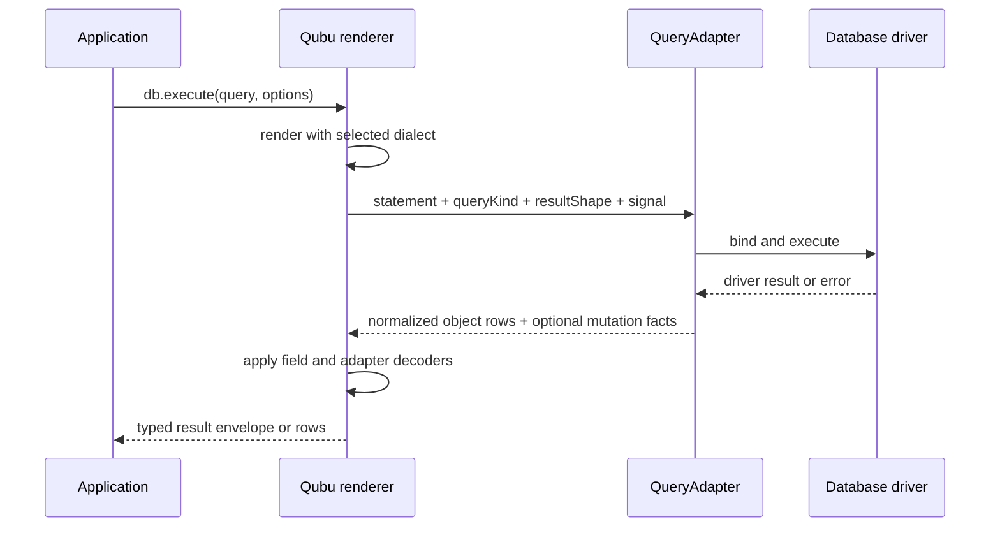

# Dialects and execution

> Keep portable query construction separate from placeholder, identifier, pagination, cast-target, and driver decisions at the rendering boundary.

## Render once, choose a policy at the boundary

`render()` returns a `RenderedQuery` with SQL text and raw parameter values. The
default renderer uses Qubu's standard SQL policy. Select a concrete dialect
subpath when a driver needs another placeholder, identifier, pagination, or
capability policy:

| Dialect      | Import              | Identifiers   | Placeholders    | Pagination policy                     |
| ------------ | ------------------- | ------------- | --------------- | ------------------------------------- |
| Standard SQL | `render(query)`     | double quotes | `?`             | `OFFSET ... ROWS FETCH ... ROWS ONLY` |
| PostgreSQL   | `postgresDialect()` | double quotes | `$1`, `$2`, ... | `LIMIT ... OFFSET ...`; `ILIKE`       |
| SQLite       | `sqliteDialect()`   | double quotes | `?`             | `LIMIT ... OFFSET ...`                |
| MySQL        | `mysqlDialect()`    | backticks     | `?`             | `LIMIT ... OFFSET ...`                |

Construct the query without choosing a driver, then render it with the policy
the adapter expects:

```ts
import { render } from "qubu"
import { postgresDialect } from "qubu/postgres"

const standard = render(query)
const postgres = render(query, postgresDialect())

standard.text
// ... WHERE ("users"."id" = ?)

postgres.text
// ... WHERE ("users"."id" = $1)
```

## Capability requirements

Portable syntax stays portable, while dialect-specific syntax carries a
capability requirement to the rendering boundary. PostgreSQL's `ilike()` is
the first such feature:

```ts
import { from, like, render, select, where } from "qubu"
import { ilike, postgresDialect } from "qubu/postgres"
import { sqliteDialect } from "qubu/sqlite"

const postgresQuery = select({ name: users.name }, from(users), where(ilike(users.name, "%ada%")))

render(postgresQuery, postgresDialect()) // supported
render(postgresQuery, sqliteDialect()) // TypeScript error
```

The same check runs at runtime when a dialect or query has been widened or
received from an untyped integration. Use the portable operator when the
query must render across dialects:

```ts
import { from, like, render, select, where } from "qubu"
import { sqliteDialect } from "qubu/sqlite"

const portableQuery = select({ name: users.name }, from(users), where(like(users.name, "%ada%")))

render(portableQuery)
render(portableQuery, sqliteDialect())
```

Custom dialects that implement a supported capability advertise it through
`createDialect({ capabilities: ['ilike'] })`. A dialect without that
advertisement is rejected for capability-bearing fragments.

Import `ilike` and `postgresDialect` from `qubu/postgres`. The root entrypoint
does not re-export concrete dialect constructors.

## The adapter owns the driver

Qubu does not open connections or bind values for a particular client. An
adapter receives an `ExecutionRequest` and returns driver-normalized object
rows. Qubu then uses the query's result shape and the adapter's decoder policy
to produce the typed `ExecutionResult`. A `TransactionalQueryAdapter` can also
pin one driver connection for a callback transaction:

```ts
import { qubu } from "qubu"
import { postgresDialect } from "qubu/postgres"
import type { ExecutionRequest, QueryAdapter } from "qubu"

declare const driver: {
  query<TRow extends object>(
    text: string,
    parameters: readonly unknown[],
    options: { signal?: AbortSignal },
  ): Promise<{ rows: readonly TRow[]; rowCount: number | null }>
}

const adapter: QueryAdapter = {
  dialect: postgresDialect(),
  async execute(request: ExecutionRequest) {
    const { statement, queryKind, signal } = request
    const result = await driver.query<Record<string, unknown>>(
      statement.text,
      statement.parameters,
      { signal },
    )
    return {
      rows: result.rows,
      ...(queryKind !== "select" && queryKind !== "set" && result.rowCount !== null
        ? { affectedRows: result.rowCount }
        : {}),
    }
  },
}
```

### Experimental cloud adapters

The workspace also publishes experimental adapters for HTTP and serverless
database clients. They are not production-ready and are intentionally outside
provider-backed CI until funded infrastructure and an external maintainer are
available.

| Package | Driver boundary | Advertised capabilities |
| --- | --- | --- |
| `@qubu/adapter-neon` | Neon HTTP PostgreSQL query function | PostgreSQL rendering, object rows, mutation counts, EXPLAIN, and fetch cancellation |
| `@qubu/adapter-planetscale` | PlanetScale serverless MySQL client | MySQL rendering, rows, mutation metadata, EXPLAIN, and provider transaction callbacks |
| `@qubu/adapter-aws-rds-data-api` | AWS RDS Data API for Aurora PostgreSQL or MySQL | Engine-specific rendering, typed Data API values/results, EXPLAIN, mutation metadata, and transaction IDs |

Neon HTTP and the RDS Data API do not advertise interactive streaming. The
RDS adapter uses named placeholders (`:p1`, `:p2`, ...), while PlanetScale uses
the MySQL dialect and the provider's own value formatting. Read each package's
README for its experimental boundary and required provider setup.

### Decode schema-aware result values

Portable boolean, date, timestamp, and JSON columns retain their logical
result domains through projection aliases, derived queries, CTEs, set
operations, and mutation `RETURNING`. Register only the conversions required
by the selected driver configuration:

```ts
import {
  booleanResultDecoder,
  dateResultDecoder,
  jsonTextResultDecoder,
  timestampResultDecoder,
} from "qubu"
import type { AdapterExecutionResult, QueryAdapter, RenderedQuery } from "qubu"
import { sqliteDialect } from "qubu/sqlite"

declare const sqliteDriver: {
  execute(statement: RenderedQuery): Promise<AdapterExecutionResult>
}

const adapter: QueryAdapter = {
  dialect: sqliteDialect(),
  decoders: {
    boolean: booleanResultDecoder,
    date: dateResultDecoder,
    timestamp: timestampResultDecoder,
    json: jsonTextResultDecoder,
  },
  async execute(request) {
    return sqliteDriver.execute(request.statement)
  },
}
```

Do not register `jsonTextResultDecoder` when the driver already returns parsed
JSON. A JSON string is otherwise ambiguous: it may be serialized JSON or an
already-decoded JSON string scalar. With no registered decoder, Qubu preserves
the driver's value.

Use a column decoder for a custom stored type, or `mapResult()` for one
expression. Both override adapter policy for that field:

```ts
import { column, mapResult, value } from "qubu"

const score = column<number>({ decode: (value) => Number(value) })
const decodedTotal = mapResult(value("42"), (value) => Number(value))
```

## Stream read results

Add `StreamingQueryAdapter` when a driver can return rows through an
adapter-owned `AsyncIterable`. The standalone `stream()` function and the
bound `db.stream()` method accept only `SELECT` and set-operation queries.
Mutations stay on `execute()` and `executeRows()`, including mutations with
`RETURNING`.

```ts
import { qubu } from "qubu"
import type { ExecutionRequest, StreamingQueryAdapter } from "qubu"
import { postgresDialect } from "qubu/postgres"

declare const driver: {
  query<TRow extends object>(
    text: string,
    parameters: readonly unknown[],
    options: { signal?: AbortSignal },
  ): Promise<{ rows: readonly TRow[]; rowCount: number | null }>
  stream<TRow extends object>(
    text: string,
    parameters: readonly unknown[],
    options: { signal?: AbortSignal },
  ): AsyncIterable<TRow>
}

const adapter: StreamingQueryAdapter = {
  dialect: postgresDialect(),
  async execute(request: ExecutionRequest) {
    const result = await driver.query<Record<string, unknown>>(
      request.statement.text,
      request.statement.parameters,
      { signal: request.signal },
    )
    return {
      rows: result.rows,
      ...(result.rowCount === null ? {} : { affectedRows: result.rowCount }),
    }
  },
  stream(request: ExecutionRequest) {
    return driver.stream<Record<string, unknown>>(
      request.statement.text,
      request.statement.parameters,
      { signal: request.signal },
    )
  },
}

const db = qubu(adapter)
for await (const row of db.stream(readQuery)) {
  consume(row)
}
```

Qubu renders the query with the selected dialect before calling `stream()`. It
passes ordered raw parameters, query kind, result shape, and the optional
`AbortSignal` in the same `ExecutionRequest` used by `execute()`. The adapter
binds values and returns the iterable. Qubu lazily decodes each row without
opening a cursor or connection, buffering rows, or imposing a fetch size.

The adapter owns the iterator's cleanup contract:

| Event                           | Adapter responsibility                                                                                        |
| ------------------------------- | ------------------------------------------------------------------------------------------------------------- |
| Normal completion               | Close the cursor and release stream-only resources before the iterable completes.                             |
| Early iterator close            | Implement `return()` so a consumer can stop without leaking resources.                                        |
| Iteration failure               | Close the cursor and release resources before the failure reaches the consumer.                               |
| Aborted signal                  | Stop the driver operation and clean up any open stream resources.                                             |
| Transaction callback completion | Consume or close every stream before the callback resolves, then commit or release the transaction resources. |

`for await` closes an iterator when a loop exits early. Code that manually
holds an iterator should close it in a `finally` block:

```ts
const iterator = db.stream(readQuery)[Symbol.asyncIterator]()
try {
  const first = await iterator.next()
  if (!first.done) consume(first.value)
} finally {
  await iterator.return?.()
}
```

Inside a transaction, use a `StreamingTransactionalQueryAdapter` so the
transaction callback receives a streaming client. The adapter must keep its
cursor and connection valid until the callback's streams finish or close:

```ts
declare const transactionalAdapter: import("qubu").StreamingTransactionalQueryAdapter
const transactionalDb = qubu(transactionalAdapter)

await transactionalDb.transaction(async (transaction) => {
  for await (const row of transaction.stream(readQuery)) {
    consume(row)
  }
})
```

The adapter decides how `next()` drives driver reads, whether it prefetches,
and how much data it buffers. Qubu only forwards the async-iterator protocol
and the abort signal. Driver errors and cancellation errors pass through
unchanged.

## Inspect query plans

Add `ExplainableQueryAdapter` when the driver can decode its EXPLAIN rows. The
standalone `explain()` function and the bound `db.explain()` method render a
plan request without calling `execute()`:

```ts
import { explain, qubu } from "qubu"
import type { ExplainableQueryAdapter } from "qubu"
import { postgresDialect } from "qubu/postgres"

type PostgresPlanRow = { "QUERY PLAN": string }

declare const driver: {
  query<TRow extends object>(
    text: string,
    parameters: readonly unknown[],
    options: { signal?: AbortSignal },
  ): Promise<{ rows: readonly TRow[] }>
}

const adapter: ExplainableQueryAdapter<PostgresPlanRow> = {
  dialect: postgresDialect(),
  async execute() {
    return { rows: [] }
  },
  async explain(request) {
    const result = await driver.query<PostgresPlanRow>(
      request.statement.text,
      request.statement.parameters,
      { signal: request.signal },
    )
    return { rows: result.rows }
  },
}

const plan = await explain(readQuery, adapter, {
  analyze: true,
  verbose: true,
})
const db = qubu(adapter)
const samePlan = await db.explain(readQuery)
```

Qubu keeps `ExplainResult.rows` in the adapter's vendor-specific shape. It
does not normalize PostgreSQL, SQLite, or MySQL plans into one tree. The
adapter owns parameter binding, plan-row decoding, connections, transactions,
and cancellation. `ExplainRequest` carries the rendered statement, ordered
raw parameters, query kind, and optional abort signal just like an ordinary
execution request.

The first-party policies accept these options:

| Dialect    | Plan options                                                                       | Restrictions                                                      |
| ---------- | ---------------------------------------------------------------------------------- | ----------------------------------------------------------------- |
| PostgreSQL | `analyze`, `verbose`, `buffers`, and `format: 'text' \| 'xml' \| 'json' \| 'yaml'` | `buffers` requires `analyze`; analysis is read-only               |
| SQLite     | `format: 'query-plan' \| 'bytecode'` or `queryPlan`                                | `analyze`, `verbose`, and `buffers` are unsupported               |
| MySQL      | `analyze` or `format: 'traditional' \| 'json' \| 'tree'`                           | `analyze` cannot be combined with `format`; analysis is read-only |

All supported queries can be explained, including `INSERT`, `UPDATE`, and
`DELETE`. Mutation EXPLAIN is always plan-only. The type and runtime
boundaries reject `analyze` for mutations so an inspection call cannot apply a
write. Unsupported options and invalid combinations raise a structured
`QueryValidationError` before the adapter is called.

## Bind the adapter once

Use `qubu()` when several calls share one adapter. The returned client keeps
the adapter available as `db.adapter` and accepts the same execution options as
the standalone functions:

```ts
const db = qubu(adapter)

const controller = new AbortController()
const result = await db.execute(query, {
  signal: controller.signal,
})

result.rows
result.affectedRows

const rows = await db.rows(readQuery)
```

`db.execute()` returns the structured result. `db.rows()` returns only its row
array. Both methods infer each row from the query projection. They do not make
query values executable or transfer connection ownership to Qubu.

## Observe bound operations

Configure hooks on a bound client when logs, traces, or metrics need the same
lifecycle view across queries, streams, plans, and transactions:

```ts
import { qubu } from "qubu"

const db = qubu(adapter, {
  hooks: {
    onOperationStart(operation) {
      console.info("Qubu operation started", operation)

      return (outcome) => {
        console.info("Qubu operation finished", operation.id, outcome)
      }
    },
    onHookError(error) {
      console.error("Qubu hook failed", error)
    },
  },
})

await db.rows(readQuery, {
  hookMetadata: { operation: "users.list" },
})
```

Query operations start after rendering and immediately before the adapter is
called. Completion reports duration, success or the original error, and
available aggregate facts such as row and affected-row counts. Transaction
queries identify their parent transaction operation. Hooks are synchronous,
and their failures are sent to `onHookError` without changing the database
operation's result.

Hook metadata accepts only strings, numbers, and booleans. Observations include
rendered SQL and parameter count, but never parameter values, result rows,
decoded values, or insert identifiers. Rendered SQL can still contain literals
introduced by unsafe SQL helpers, so treat it according to the application's
logging policy.

Streaming adapters are still called eagerly. A consumed stream completes its
observation when it is exhausted, closed early, or fails. A stream created but
never consumed has no completion observation. Hooks are available only on
clients created with `qubu()`; standalone execution functions remain
unobserved.

## Run a transaction

Use a transactional adapter when several queries must share one commit or
rollback boundary:

```ts
import { qubu } from "qubu"
import type { TransactionalQueryAdapter } from "qubu"

declare const transactionalAdapter: TransactionalQueryAdapter
const transactionalDb = qubu(transactionalAdapter)

const result = await transactionalDb.transaction(async (transaction) => {
  await transaction.execute(firstMutation)
  await transaction.execute(secondMutation)
  return transaction.rows(readQuery)
})
```

The adapter owns the driver lifecycle. It acquires and pins one connection,
begins the transaction, invokes the callback, commits after it resolves, rolls
back after it rejects, and releases the connection in every case. Qubu only
creates the scoped client and passes the callback result through. It never
emits `BEGIN`, `COMMIT`, or `ROLLBACK` itself.

The transaction client exposes `execute()` and `rows()` but no public
`transaction()` method, so nested transactions are not part of this contract.
When the adapter also implements `StreamingQueryAdapter`, the scoped client
also exposes `stream()` and its streams follow the cleanup rule above. Use
adapter-specific savepoints when a driver needs nested partial rollback.
`TransactionOptions.signal` is passed to the adapter. Isolation levels and
other driver-specific settings remain adapter-specific.

The standalone functions remain useful when the adapter varies by call or a
small module does not need a bound client:

```ts
import { execute, executeRows } from "qubu"

const result = await execute(query, adapter)
const rows = await executeRows(readQuery, adapter)
```

| Result field   | Adapter type                         | Contract                                                                              |
| -------------- | ------------------------------------ | ------------------------------------------------------------------------------------- |
| `rows`         | `readonly Record<string, unknown>[]` | Key by rendered aliases; Qubu returns the decoded `readonly TRow[]`                   |
| `affectedRows` | `number \| bigint`                   | Rows inserted, updated, or deleted when the driver reports an affected count          |
| `changedRows`  | `number \| bigint`                   | Rows whose stored values changed when the driver distinguishes them from matched rows |
| `insertId`     | `string \| number \| bigint`         | One insert identifier when the driver reports it                                      |

The last three fields are optional. For example, an adapter can map PostgreSQL
`rowCount`, MySQL `affectedRows`, `changedRows`, and `insertId`, or SQLite
`changes` and `lastInsertRowid`. Omit a fact that the selected driver cannot
report accurately. Qubu does not derive mutation metadata from returned rows.

The adapter's `dialect` becomes the default for standalone and bound execution.
A `dialect` in the execution options overrides that rendering policy. Qubu
passes `signal`, `queryKind`, and `resultShape` to the adapter without changing
them. The adapter decides whether and how its driver supports cancellation.
Driver errors pass through unchanged. Decoder failures become a
`ResultDecodingError` that identifies the row and field without exposing the
raw value.



## Create a small custom dialect

Use `createDialect()` when a driver needs a different policy but the query
syntax stays portable:

```ts
import { render } from "qubu"
import { createDialect } from "qubu/core"

const namedParameters = createDialect({
  name: "named-parameters",
  placeholder: (position) => `:p${position}`,
  castTypes: { text: "STRING" },
})

const statement = render(query, namedParameters)
// ... WHERE ("users"."id" = :p1)
```

`castTypes` overrides how logical targets from definitions such as `text()`
render in `CAST` expressions. Omitted entries use the standard spelling. A
custom definition's explicit `castType` is emitted verbatim instead of passing
through this map.

For syntax that is not a small policy decision, add a [custom fragment or
clause](guides/extensions/overview.md) instead of making the standard dialect
pretend that vendor behavior is portable.

> [!WARNING]
> `RenderedQuery.parameters` contains raw application values. The adapter must
> bind or encode them using the driver API; do not concatenate them into
> `RenderedQuery.text`.
