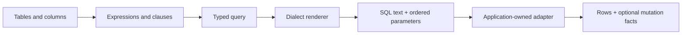

# Qubu

> Build SQL queries from typed tables and reusable values.

Qubu builds SQL from reusable values. You can combine query parts without
changing a shared query-builder object.

TypeScript checks:

- Which fields the query returns and their types.
- Whether each column belongs to a source in the query.
- Whether a result can be `null`.

Render a query to inspect its SQL text and ordered parameters.

The preferred source style names each projected field and writes the final
`select()` clauses in SQL order. Clause values remain order-independent at
runtime, so a reusable `where()` or `orderBy()` fragment can be built earlier
and placed in that final call where it reads best.

## Start here

If this is your first query, follow [Getting started](getting-started.md) to
define a table, build a `SELECT`, and inspect its SQL and parameters.

## Build and run queries

- [Build a `SELECT`](guides/select/overview.md) with projections, joins,
  predicates, ordering, and grouping.
- [Compose queries](guides/compose-queries.md) with CTEs, derived tables,
  subqueries, and set operations.
- [Compose SQL templates](guides/sql-templates.md) for trusted syntax with
  bound values and metadata-preserving fragment substitutions.
- [Write mutations](guides/mutations.md) with typed `INSERT`, `UPDATE`, and
  `DELETE` statements.
- [Use Qubu tables with Drizzle](guides/drizzle.md) while moving query call
  sites without duplicating schema declarations.
- [Use Qubu with Better Auth](guides/better-auth.md) with plugin-aware schema
  derivation and a native transactional database adapter.
- [Extend Qubu](guides/extensions/overview.md) with a custom source, clause,
  dialect policy, or typed expression.
- [Query nested JSON](guides/json.md) or read scalars from structured paths.
- [Enable the Vite compiler hint](guides/vite-plugin.md) when query modules
  should opt into named imports through a directive.

## Work with schemas and migrations

- [Inspect an existing database](schema/introspection.md) using a connection you provide.
- [Generate a schema module](schema/code-generation.md) from an introspection result without losing schema facts.
- [Compare snapshots](schema/diff.md) with explicit rename hints and reviewable
  safety diagnostics.
- [Build migration plans](schema/migration-plans.md) as reviewed, deterministic
  data before DDL emission.
- [Emit DDL](schema/ddl-emission.md) from an approved migration plan without
  handing Qubu a database connection.
- [Operate migrations](migrations/index.md) with reviewed migration files and a verified adapter.

## The query pipeline

The same query value can be rendered for inspection or passed to an adapter for
execution. The application-owned adapter handles the driver, database
connection, and driver-specific row and mutation-result details.



Values become bound parameters, and the active dialect quotes identifiers. Raw
SQL is available through explicit unsafe helpers. The call site shows where
that unchecked syntax enters the query.

## Understand the Qubu model

Use these pages when a guide leaves a rule unexplained or when an extension
needs to preserve a fact across composition:

| Model                    | Start with                                          | Covers                                                                              |
| ------------------------ | --------------------------------------------------- | ----------------------------------------------------------------------------------- |
| Query model              | [Source scope](query-model/source-scope.md)         | Source identity, result shapes, fragments, metadata, and query composition          |
| Schema model             | [Tables and names](schema/tables-and-names.md)      | Tables, snapshots, diffs, migration plans, and DDL emission                         |
| Migration operations     | [Migration operations](migrations/index.md)         | Artifacts, adapters, CLI policy, baselines, execution, and recovery                 |
| Database introspection   | [Database introspection](schema/introspection.md)   | Catalog readers, Snapshot v1 mapping, identities, diagnostics, and support limits   |
| Schema source generation | [Generate a schema](schema/code-generation.md)      | Machine-owned TypeScript, identity handoff, controlled mappings, and v1 exclusions  |
| Rendering and execution  | [Dialects and execution](dialects-and-execution.md) | Placeholder and identifier policies, capabilities, adapters, and raw-SQL boundaries |
| SQL semantic types       | [SQL semantic types](sql-semantic-types.md)         | Application types, SQL domains, nullability, and compatible operations              |

## A small example

```ts
import { eq, from, integer, render, select, table, text, where } from "qubu"

const users = table("users", {
  id: integer(),
  name: text(),
})

const query = select({ id: users.id, name: users.name }, from(users), where(eq(users.id, 7)))

render(query)
// {
// text: 'SELECT "users"."id" AS "id", "users"."name" AS "name" FROM "users" WHERE ("users"."id" = ?)',
// parameters: [7],
// }
```

The inferred row is `{ id: number; name: string }`. The value `7` stays out
of the SQL text and appears in the `parameters` array in placeholder order.

## Find support details

- [Supported features](reference/supported-surface.md) lists package imports and
  explains which responsibilities stay with your application.
- [Troubleshooting](troubleshooting.md) starts from common errors and explains
  how to fix them.
