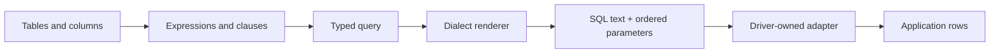

# Qubu

> Query builder for TypeScript: reads like SQL, declarative schema, highly composable, type inference, simple type declarations

Qubu is a functional-first SQL builder for TypeScript. Tables, expressions,
clauses, and complete queries are values that compose without a mutable query
builder. The result keeps SQL recognizable while TypeScript tracks selected
row shapes, source scope, and nullability; rendering still collects runtime
parameters in placeholder order.

## Start here

If this is your first query, follow [Getting Started](getting-started.md) to
define a table, build a `SELECT`, and inspect its SQL and parameters.

Use the rest of the docs by task:

- [Build a `SELECT`](guides/select.md) with filters, joins, grouping, ordering,
  and pagination.
- [Compose queries](guides/compose-queries.md) with CTEs, derived tables,
  subqueries, and set operations.
- [Write mutations](guides/mutations.md) with typed `INSERT`, `UPDATE`, and
  `DELETE` statements.
- [Extend Qubu](guides/extensions.md) with a custom dialect policy, fragment,
  or clause when the built-in surface is not enough.
- [Use dialects and adapters](concepts/dialects-and-execution.md) when SQL must
  match a particular driver or execution layer.
- [Enable the Vite compiler hint](guides/vite-plugin.md) when query modules
  should opt into named imports through a directive.

## The Qubu pipeline

The same query value can be rendered for inspection or passed to an adapter for
execution. The adapter, not the query builder, owns the database connection and
driver-specific row handling.



Values become bound parameters, and identifiers are quoted through the active
dialect. Raw SQL is available through explicit unsafe primitives, so the code
that crosses that boundary remains visible at the call site.

## A small example

```ts
import { eq, from, integer, render, select, table, text, where } from 'qubu'

const users = table('users', {
  id: integer(),
  name: text(),
})

const query = select(
  { id: users.id, name: users.name },
  from(users),
  where(eq(users.id, 7))
)

render(query)
// {
//   text: 'SELECT "users"."id" AS "id", "users"."name" AS "name" FROM "users" WHERE ("users"."id" = ?)',
//   parameters: [7],
// }
```

The inferred row is `{ id: number; name: string }`. The value `7` stays out of
the SQL text and appears in the `parameters` array in placeholder order.

## Choose the next concept

| If you need to decide...                                       | Read...                                                       |
| -------------------------------------------------------------- | ------------------------------------------------------------- |
| Why a column can be rejected outside `FROM` or `JOIN` scope    | [Fragments and source scope](concepts/fragments-and-scope.md) |
| How a query changes across PostgreSQL, SQLite, or MySQL        | [Dialects and execution](concepts/dialects-and-execution.md)  |
| How nullability, defaults, and generated columns affect writes | [Schema and type metadata](concepts/schema-and-types.md)      |
| Which package entrypoint or feature to use                     | [Supported surface](reference/supported-surface.md)           |
| What a failure means and what to verify                        | [Troubleshooting](troubleshooting.md)                         |

Qubu builds and renders SQL; it does not provide an ORM, migrations, connection
pooling, transactions, or relationship loading. See the [supported
surface](reference/supported-surface.md#boundary) for the full boundary.
