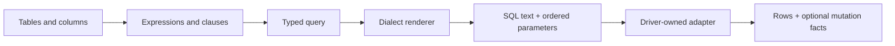

# Qubu

> Build parameterized SQL from typed tables, expressions, and clauses.

Qubu builds SQL from values. Tables, expressions, clauses, and complete queries
compose without a mutable query builder. TypeScript tracks selected row shapes,
source scope, and nullability, while rendering returns SQL text and ordered
parameters.

The preferred source style names each projected field and writes the final
`select()` clauses in SQL order. Clause values remain order-independent at
runtime, so a reusable `where()` or `orderBy()` fragment can be built earlier
and placed in that final call where it reads best.

## Start here

If this is your first query, follow [Getting started](getting-started.md) to
define a table, build a `SELECT`, and inspect its SQL and parameters.

## Choose a task

- [Build a `SELECT`](guides/select/overview.md) with projections, joins,
  predicates, ordering, and grouping.
- [Compose queries](guides/compose-queries.md) with CTEs, derived tables,
  subqueries, and set operations.
- [Write mutations](guides/mutations.md) with typed `INSERT`, `UPDATE`, and
  `DELETE` statements.
- [Use Qubu tables with Drizzle](guides/drizzle.md) while moving query call
  sites without duplicating schema declarations.
- [Extend Qubu](guides/extensions/overview.md) with a custom source, clause,
  dialect policy, or typed expression.
- [Read JSON scalars](guides/json.md) from structured JSON paths.
- [Enable the Vite compiler hint](guides/vite-plugin.md) when query modules
  should opt into named imports through a directive.
- [Inspect an existing database](schema/introspection.md) through the optional
  user-owned catalog boundary.
- [Compare snapshots](schema/diff.md) with explicit rename hints and reviewable
  safety diagnostics.
- [Build migration plans](schema/migration-plans.md) as reviewed, deterministic
  data before a later DDL step.
- [Emit approved DDL](schema/ddl-emission.md) with dialect preflight while
  leaving connection and migration execution to the application.

## The Qubu pipeline

The same query value can be rendered for inspection or passed to an adapter for
execution. The adapter, not the query builder, owns the database connection and
driver-specific row and mutation-result handling.



Values become bound parameters, and the active dialect quotes identifiers. Raw
SQL is available through explicit unsafe helpers. The call site shows where
that unchecked syntax enters the query.

## Understand the Qubu model

Use these pages when a guide leaves a rule unexplained or when an extension
needs to preserve a fact across composition:

| Model                   | Start with                                          | Covers                                                                              |
| ----------------------- | --------------------------------------------------- | ----------------------------------------------------------------------------------- |
| Query model             | [Source scope](query-model/source-scope.md)         | Source identity, result shapes, fragments, metadata, and query composition          |
| Schema model            | [Tables and names](schema/tables-and-names.md)      | Tables, write types, constraints, storage, schema SQL, and snapshots                |
| Database introspection  | [Database introspection](schema/introspection.md)   | Catalog readers, Snapshot v1 mapping, identities, diagnostics, and support limits   |
| Rendering and execution | [Dialects and execution](dialects-and-execution.md) | Placeholder and identifier policies, capabilities, adapters, and raw-SQL boundaries |
| SQL semantic types      | [SQL semantic types](sql-semantic-types.md)         | Application types, SQL domains, nullability, and compatible operations              |

## A small example

```ts
import { eq, from, integer, render, select, table, text, where } from 'qubu'

const users = table('users', {
  id: integer(),
  name: text(),
})

const query = select(
  { id: users.id, name: users.name },
  from(users),
  where(eq(users.id, 7))
)

render(query)
// {
// text: 'SELECT "users"."id" AS "id", "users"."name" AS "name" FROM "users" WHERE ("users"."id" = ?)',
// parameters: [7],
// }
```

The inferred row is `{ id: number; name: string }`. The value `7` stays out
of the SQL text and appears in the `parameters` array in placeholder order.

The [supported features](reference/supported-surface.md) page lists package
entrypoints and boundaries. [Troubleshooting](troubleshooting.md) starts from
common errors and points to the concept page behind each one.

Qubu builds and renders query SQL, snapshots schema facts, compares snapshots,
plans reviewed changes, and can emit deterministic DDL. It does not open a
database connection, execute migrations, provide an ORM, manage connection
pooling or transactions, or load relationships.
