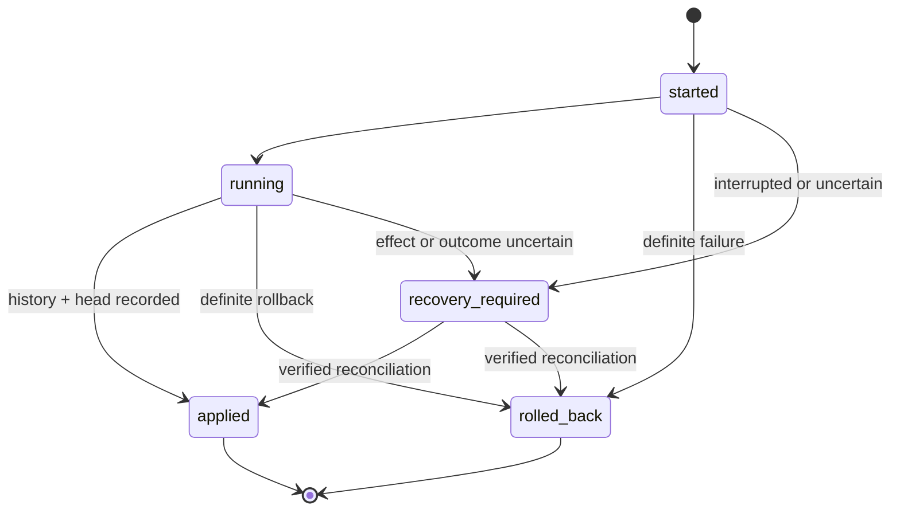

# Recovery and reconciliation

> Stop after an ambiguous attempt, prove the live outcome, and repair journal lineage without replaying SQL.

The journal has one versioned metadata row with an atomic head, immutable
applied artifact records, mutable attempts, phase/statement checkpoints, and
append-only reconciliation records. Adapter implementations store it in the
same database and reserve `__qubu_migration_`-prefixed objects from managed
schema inspection.

| Record           | Fields and invariant                                                                                           |
| ---------------- | -------------------------------------------------------------------------------------------------------------- |
| Metadata         | `format`, `version`, and nullable SHA-256 `head`; the head equals the final applied digest                     |
| Applied artifact | `artifactId`, `sequence`, artifact/parent digests, `kind`, `attemptId`, and `appliedAt`; records are immutable |
| Attempt          | ID, artifact ID/digest, expected head, state, timestamps, and optional redacted failure                        |
| Checkpoint       | Attempt/phase IDs, optional statement ID, `started` or `completed`, and timestamp                              |
| Reconciliation   | Attempt ID, proven `applied` or `rolled_back` outcome, non-empty reason, and timestamp                         |

## Attempt state machine

The diagram shows every legal state transition. `started`, `running`, and
`recovery_required` all block later migrations until the attempt reaches a
terminal state.



An `applied` attempt must have a matching immutable applied record. Applied
records must form a zero-based linear sequence whose final digest equals the
metadata head. The journal must be an exact prefix of the artifact repository.
Duplicate IDs or digests, forks, gaps, parent mismatches, tampering, a stale
head, or a non-prefix repository fail before any statement executes.

## Execution and concurrency guarantees

For each invocation, the executor verifies the entire repository, opens one
pinned session, checks capabilities, acquires the migrator lease, validates the
journal and repository prefix, checks the live before-snapshot digest, then
applies each pending artifact. Within an artifact it creates an attempt,
executes ordered phases with preconditions and postconditions, writes durable
checkpoints, appends immutable history, and compare-and-swaps the head.
Resources are released in reverse order: DDL lock, migrator lease, then session.

A second runner cannot rely on the lease alone. Atomic applied-record/head
advancement uses the expected parent as a compare-and-swap guard. A runner that
observes the already-matching head exits idempotently; a conflicting head is a
structured `concurrency` error.

| Phase requirement | Executor behavior                                                                                                                                   |
| ----------------- | --------------------------------------------------------------------------------------------------------------------------------------------------- |
| `required`        | Refuses an adapter without proven transactional DDL; runs that phase transactionally, with the applied/head update in the final phase's transaction |
| `optional`        | Uses a transaction when `optionalTransactions` is true; otherwise relies on checkpoints                                                             |
| `forbidden`       | Runs outside a transaction only on a profile advertising checkpointed forbidden phases                                                              |
| Mixed program     | Reports phase-level behavior and returns `mixed` atomicity rather than claiming whole-migration atomicity                                           |

Program compilation has no `unknown` transaction state: unresolved requirements
must be resolved by the renderer or explicit custom program before sealing.
Transactions are phase-scoped. Do not infer that an earlier committed phase
will roll back because a later phase fails.

Errors use stable codes: `validation`, `policy`, `drift`, `concurrency`,
`capability`, `definite-rollback`, `uncertain-outcome`, `recovery-required`,
`aborted`, and `adapter`. Context may include artifact, attempt, phase, and
statement identifiers. Persisted failures omit SQL parameters and credentials.

Do not automatically retry after any statement may have taken effect. Only an
error explicitly marked `retry: "safe"`—normally validation or a failure proven
before execution—is retryable. A definite transaction rollback ends as
`rolled_back`; an interrupted non-transactional phase, ambiguous commit or
rollback, or unproven effect ends as `recovery_required`.

## Reconciliation runbook

1. Stop deploys and every migration runner for the target database. Preserve
   logs, the artifact repository, the database, and journal rows.
2. Run `qubu migrate status --format json --non-interactive`. Record the
   interrupted attempt ID, artifact digest, checkpoints, journal head, pending
   chain, managed drift, and incompatible requirements.
3. Find the exact artifact by digest. Verify the repository again; do not edit,
   renumber, or reseal it to make the chain pass.
4. Inspect the live database through adapter/application-owned checks. Use
   completed checkpoints only as evidence of where to inspect, not as proof
   that a statement committed. Verify the artifact's preconditions,
   postconditions, and expected snapshot.
5. Decide `applied` only if the application can prove the artifact's complete
   post-state. Decide `rolled_back` only if it can prove the complete pre-state
   and absence of all intended effects. If neither is provable, restore or
   repair under an application-specific incident plan; do not guess.
6. Configure `verifyReconciliation` to repeat that proof, then run:

   ```bash
   qubu migrate reconcile <attempt-id> \
     --outcome applied \
     --reason "Verified every postcondition against incident INC-123" \
     --format json --non-interactive
   ```

   Use `--outcome rolled_back` only for a proven pre-state. The reconciler
   requires a non-empty reason and the application verifier to return true.

7. Run `migrate status` again. Confirm no interrupted attempt remains, the head
   and applied history form the repository prefix, managed drift is zero, and
   only the intended pending artifacts remain.
8. Resume with `migrate apply`. Never replay individual SQL statements from the
   uncertain artifact.

When reconciliation records `applied`, Qubu appends the missing immutable
history/head for the exact artifact if needed. When it records `rolled_back`,
the head stays at the previous artifact. Both outcomes append an audit record.
