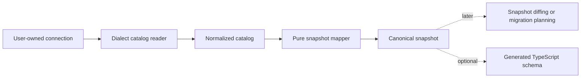

# Database introspection

> Read one existing database namespace into explainable catalog data and a canonical Snapshot v1 without giving Qubu ownership of the connection.

Database introspection is an optional capability exported from
`qubu/introspection`. It discovers database facts; it does not recreate the
original TypeScript declarations. Planning and DDL emission use the separate
`@qubu/migrate/plan` and `@qubu/migrate/ddl` entrypoints, while migration
execution remains application-owned. The separate
`qubu/codegen` entrypoint can create a new machine-owned schema module from a
complete Snapshot v1 result.

## The pipeline

The caller owns the connection and supplies a small catalog query adapter:



The reader owns catalog SQL and dialect-specific row normalization. The
normalized catalog retains physical names, native types, opaque SQL text,
provenance, current-run catalog references, capabilities, deferred objects,
and diagnostics. The mapper owns Snapshot v1 shape, stable ordering, identity
continuity, and strict versus lossy output.

## Supply a connection

Qubu does not open or close a connection, select a driver, manage a pool, retry
queries, authenticate, or start a transaction. Adapt the driver you already
use to `CatalogConnection`:

```ts
import type { CatalogConnection } from "qubu/introspection"

const connection: CatalogConnection = {
  dialect: "sqlite",
  query(statement, options) {
    // Adapt this call to the driver used by the application.
    return db.query(statement, options)
  },
}
```

The adapter receives fixed catalog statements and bound parameters. Catalog
text returned by the database is data. Qubu never evaluates it or turns it
into an executable schema expression.

## Read and map a catalog

Readers return normalized facts. Mapping is a separate operation so the same
catalog can later support inspection, source generation, or another snapshot
format:

```ts
import { mapCatalogToSnapshot } from "qubu/introspection"
import { readCatalog } from "qubu/introspection/sqlite"

const catalog = await readCatalog(connection, { namespace: "main" })
const result = mapCatalogToSnapshot(catalog, {
  namespace: "main",
  mode: "strict",
})

if (!result.ok) {
  throw new Error(result.diagnostics.map((issue) => issue.message).join("\n"))
}

result.snapshot.tables // canonical Snapshot v1 data
```

Pass the successful result itself—not a detached or edited snapshot—to
`generateSchemaSource()` when a replaceable TypeScript schema is needed. See
[Generate a schema from introspection](code-generation.md) for that workflow
and its identity handoff.

Readers may expose additional typed object families through the normalized
catalog. Use `createCompleteIntrospectionCatalog()` to materialize and freeze
all optional collections, then `mapCatalogToCompleteSnapshot()` when an
adapter-supported family such as views, routines, triggers, partitions,
collations, comments, or retained opaque and deferred objects must cross the
strict Snapshot v1 boundary. `mapCatalogToSnapshot()` delegates to the complete
mapper, so the canonical result is always Snapshot v1.

The result is successful only when Snapshot v1 validation succeeds. A failed
result may retain the partial catalog and structured diagnostics, but it has no
snapshot.

## Identity and physical names

Introspection uses this identity precedence:

1. an explicit identity hint;
2. a matching entity in a previous snapshot;
3. the physical database name;
4. a deterministic fallback for unnamed or invalid names.

Physical names remain unchanged in the snapshot. OIDs, SQLite rowids, and
internal `sqlite_autoindex_*` names are current-run or implementation details,
not persisted Qubu identities. A changed physical name is not automatically a
rename. Pass the previous snapshot or an identity hint when a later diff must
preserve identity across a rename. See [snapshot diffing](diff.md) for the
comparison and hint boundary.

Each Snapshot v1 result selects one namespace: a PostgreSQL schema, MySQL
database, or SQLite database such as `main`. It does not combine attached
databases or multiple PostgreSQL schemas into one value.

## Strict and lossy output

Strict mode is the default. If an included table, column, default, generated
expression, identity, constraint, foreign key, or index cannot be represented
soundly, mapping returns diagnostics and no snapshot.

Lossy mode is explicit. It may return a snapshot with warnings, but the result
is marked lossy. Migration planning blocks lossy facts unless the caller
explicitly handles the omitted behavior.

Only unambiguous literal defaults become snapshot literals. Other defaults,
generated expressions, checks, predicates, and expression index terms remain
dialect-tagged SQL. Falsy values such as `0`, `false`, `NULL`, and empty
strings are preserved.

PostgreSQL readers expose views, materialized views, sequences, enums, domains,
collations, routines, triggers, policies, partitions, extensions, comments,
and ownership as typed complete catalog records. `mapCatalogToCompleteSnapshot`
retains those records in Snapshot v1. `mapCatalogToSnapshot()` uses the same
complete mapping and does not fabricate these objects into tables. If a
PostgreSQL catalog row lacks the evidence needed for
safe normalization, the reader retains a deferred or opaque record and emits a
diagnostic.

SQLite readers expose recoverable views and triggers as typed complete records.
They retain virtual and shadow tables as deferred objects, and keep attached
databases outside the selected namespace as opaque boundary records. SQLite
declared types, derived affinity, generated expressions, rowid identity, and
`AUTOINCREMENT` stay tagged with SQLite dialect metadata. When an attached
database is selected, table PRAGMAs may be visible but CREATE SQL remains
limited to the fixed `main` and `temp` catalog statements, so the reader marks
the catalog visibility as limited instead of combining namespaces.

## MySQL 8 complete catalog surface

The MySQL reader supports MySQL 8.0.16 and later within the MySQL 8 series and
rejects MariaDB. It reads one selected database from `INFORMATION_SCHEMA` and
keeps catalog SQL as tagged, unevaluated MySQL data. The complete catalog has
typed records for views, routines and parameters, triggers, partitions,
collations used by the selected tables or columns, and comments.

View definitions come from `INFORMATION_SCHEMA.VIEWS`. The reader cross-
references each view with its `INFORMATION_SCHEMA.COLUMNS` rows by physical
table name, so view columns remain attached to the view and Snapshot v1 can
validate their own column IDs. A missing definition or an unresolved
cross-object reference becomes a deferred record with a diagnostic.

MySQL scheduled events are kept as `CatalogOpaqueObject` records with their
metadata and definition tagged as opaque SQL. The reader emits an
`unmodeled-object` warning, and Snapshot v1 retains the record in
`opaqueObjects` without treating it as a typed routine, trigger, or migration
operation.

Sequences and materialized views are not typed MySQL families. A sequence-like
or other non-base table row reported by the catalog is retained as a deferred
object. MySQL row-level security (RLS) policies, extension objects, and
ownership are unsupported. Definers are retained as dialect metadata on
objects that expose them; they do not become ownership records. MySQL capability flags mark
these families as unsupported.

The query and normalization layout follows the catalog-reading portions of the
[Drizzle MySQL introspector](https://github.com/drizzle-team/drizzle-orm/blob/main/drizzle-kit/src/introspect-mysql.ts).
The reader keeps that metadata as normalized typed data and never evaluates
database-provided SQL. Optional source generation remains a later, pure step
with a controlled literal printer.

Use `mapCatalogToSnapshot()` or `mapCatalogToCompleteSnapshot()` for the typed
MySQL families and their opaque or deferred boundaries.

## Diagnostics and safety

Diagnostics include a severity, stable code, catalog path, physical reference
when available, and a remediation hint. They distinguish connection/query
failures, permission limits, unsupported products or versions, unresolved
references, expression recovery failures, unmodeled objects, and lossy
mappings.

Introspection is read-only from Qubu's perspective. Do not pass credentials or
DSNs through diagnostic fields. Keep driver-specific error text in the
application's logging boundary, and treat database-provided SQL as opaque
input.

## What comes next

The canonical snapshot is the handoff to Qubu's pure schema pipeline:

- diffing compares canonical snapshots;
- rename resolution consumes previous/current snapshots and explicit hints;
- migration planning consumes semantic diff operations;
- DDL emitters consume approved plans and dialect capabilities;
- source generation creates a new machine-owned Snapshot v1 schema baseline.

None of those layers opens a database connection or changes how introspection
represents catalog facts. DDL emission produces statements; it does not apply
them. The [ownership map](../reference/supported-surface.md#ownership-boundary)
keeps this pure handoff separate from the pinned adapter session used by the
[portable migration executor](../migrations/recovery.md#execution-and-concurrency-guarantees).

See the [introspection support matrix](../reference/introspection-support.md)
for version baselines and dialect-specific limits. Snapshot serialization
itself remains documented in [Canonical schema snapshots](snapshots.md).
