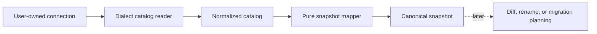

# Database introspection

> Read one existing database namespace into explainable catalog data and an optional canonical Snapshot v1 or complete Snapshot v2 without giving Qubu ownership of the connection.

Database introspection is an optional capability exported from
`qubu/introspection`. It discovers database facts. It does not recreate the
TypeScript declarations that originally produced a schema, and it does not
plan or execute migrations.

## The pipeline

The caller owns the connection and supplies a small catalog query adapter:



The reader owns catalog SQL and dialect-specific row normalization. The
normalized catalog retains physical names, native types, opaque SQL text,
provenance, current-run catalog references, capabilities, deferred objects,
and diagnostics. The mapper owns Snapshot v1 shape, stable ordering, identity
continuity, and strict versus lossy output.

## Supply a connection

Qubu does not open or close a connection, select a driver, manage a pool, retry
queries, authenticate, or start a transaction. Adapt the driver you already
use to `CatalogConnection`:

```ts
import type { CatalogConnection } from 'qubu/introspection'

const connection: CatalogConnection = {
  dialect: 'sqlite',
  query(statement, options) {
    // Adapt this call to the driver used by the application.
    return db.query(statement.text, statement.parameters, options)
  },
}
```

The adapter receives fixed catalog statements and bound parameters. Catalog
text returned by the database is data. Qubu never evaluates it or turns it
into an executable schema expression.

## Read and map a catalog

Readers return normalized facts. Mapping is a separate operation so the same
catalog can later support inspection, source generation, or another snapshot
format:

```ts
import { mapCatalogToSnapshot, readSqliteCatalog } from 'qubu/introspection'

const catalog = await readSqliteCatalog(connection, { namespace: 'main' })
const result = mapCatalogToSnapshot(catalog, { namespace: 'main' })

if (!result.ok) {
  throw new Error(result.diagnostics.map(issue => issue.message).join('\n'))
}

result.snapshot.tables // canonical Snapshot v1 data
```

Readers may expose additional typed object families through the normalized
catalog. Use `createCompleteIntrospectionCatalog()` to materialize and freeze
all optional collections, then `mapCatalogToCompleteSnapshot()` when views,
sequences, routines, policies, comments, ownership, and retained opaque or
deferred objects must cross the strict Snapshot v2 boundary. Snapshot v1 is
still selected explicitly by `mapCatalogToSnapshot()` and remains table-shaped.

The result is successful only when Snapshot v1 validation succeeds. A failed
result may retain the partial catalog and structured diagnostics, but it has no
snapshot.

## Identity and physical names

Introspection uses this identity precedence:

1. an explicit identity hint;
2. a matching entity in a previous snapshot;
3. the physical database name;
4. a deterministic fallback for unnamed or invalid names.

Physical names remain unchanged in the snapshot. OIDs, SQLite rowids, and
internal `sqlite_autoindex_*` names are current-run or implementation details,
not persisted Qubu identities. A changed physical name is not automatically a
rename. Pass the previous snapshot or an identity hint when a later diff must
preserve identity across a rename.

The first version selects one namespace: a PostgreSQL schema, MySQL database,
or SQLite database such as `main`. It does not combine attached databases or
multiple PostgreSQL schemas into one Snapshot v1 value.

## Strict and lossy output

Strict mode is the default. If an included table, column, default, generated
expression, identity, constraint, foreign key, or index cannot be represented
soundly, mapping returns diagnostics and no snapshot.

Lossy mode is explicit. It may return a snapshot with warnings, but the result
is marked lossy. Future migration planning should reject lossy output unless
the caller explicitly handles the omitted behavior.

Only unambiguous literal defaults become snapshot literals. Other defaults,
generated expressions, checks, predicates, and expression index terms remain
dialect-tagged SQL. Falsy values such as `0`, `false`, `NULL`, and empty
strings are preserved.

PostgreSQL readers expose views, materialized views, sequences, enums, domains,
collations, routines, triggers, policies, partitions, extensions, comments,
and ownership as typed complete catalog records. `mapCatalogToCompleteSnapshot`
retains those records in Snapshot v2. The existing `mapCatalogToSnapshot`
mapper still emits the table-only Snapshot v1 and does not fabricate these
objects into tables. If a PostgreSQL catalog row lacks the evidence needed for
safe normalization, the reader retains a deferred or opaque record and emits a
diagnostic.

SQLite readers expose recoverable views and triggers as typed complete records.
They retain virtual and shadow tables as deferred objects, and keep attached
databases outside the selected namespace as opaque boundary records. SQLite
declared types, derived affinity, generated expressions, rowid identity, and
`AUTOINCREMENT` stay tagged with SQLite dialect metadata. When an attached
database is selected, table PRAGMAs may be visible but CREATE SQL remains
limited to the fixed `main` and `temp` catalog statements, so the reader marks
the catalog visibility as limited instead of combining namespaces.

## Diagnostics and safety

Diagnostics include a severity, stable code, catalog path, physical reference
when available, and a remediation hint. They distinguish connection/query
failures, permission limits, unsupported products or versions, unresolved
references, expression recovery failures, unmodeled objects, and lossy
mappings.

Introspection is read-only from Qubu's perspective. Do not pass credentials or
DSNs through diagnostic fields. Keep driver-specific error text in the
application's logging boundary, and treat database-provided SQL as opaque
input.

## What comes next

The canonical snapshot is the handoff to future tooling:

- diffing compares canonical snapshots;
- rename resolution consumes previous/current snapshots and explicit hints;
- migration planning consumes semantic diff operations;
- DDL adapters consume plans and dialect capabilities.

None of those layers opens a database connection or changes how introspection
represents catalog facts.

See the [introspection support matrix](../reference/introspection-support.md)
for version baselines and dialect-specific limits. Snapshot serialization
itself remains documented in [Canonical schema snapshots](snapshots.md).
