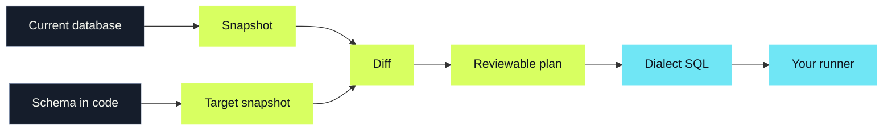

  
QUBU / A SQL STORY

  <h1>Build it in pieces. Keep the meaning.</h1>
  
A composable way to build queries, understand schemas, and change databases without losing the plot.

  

    
    
    
    
    
    
  

  
QubuSQL that stays composable

---

THE FRICTION

<h2>SQL is readable. The glue around it gets weird.</h2>

  

    
The first query is easy. Then the query becomes a report, a reusable source, a write, a dialect edge case, and a schema change.

    
Suddenly, the same idea has five different homes. Every new abstraction asks you to translate.

  

  

    
query builder<b>SELECT ...</b>

    
schema model<b>table + types</b>

    
migration tool<b>diff + SQL</b>

    
same intent <strong>different language</strong>

  

---

THE IDEA

<h2>Start with pieces that know what they are.</h2>

  

    
01 / SOURCES

    <h3>Tables and columns</h3>
    <code>users.email</code>
    
A real source, not a string with good intentions.

  

  

    
02 / MEANING

    <h3>Expressions</h3>
    <code>eq(users.id, 42)</code>
    
Values, nullability, and scope travel with the piece.

  

  

    
03 / SHAPE

    <h3>Clauses</h3>
    <code>where(...) · orderBy(...)</code>
    
Build the query in the order your brain gets there.

  

  

    
04 / POLICY

    <h3>Dialects</h3>
    <code>postgresDialect()</code>
    
Keep the differences visible at the edge.

  

---

COMPOSABILITY

<h2>Pieces stay useful when they move.</h2>

  

    
<label>report.ts</label>

    <pre>const activeUsers = cte(
  'active_users',
  select(
    { id: users.id, name: users.name },
    from(users),
    where(isNotNull(users.email)),
  ),
)
const report = select(
  { displayName: activeUsers.name },
  withCte(activeUsers),
  from(activeUsers),
)</pre>
  

  

    
1
A query can become a source.

    
2
That source can feed the next query.

    
3
The result shape stays known as it moves.

  

No giant mutable builder. No restart from scratch.

---

ONE MODEL, MANY SHAPES

<h2>Read. Write. Extend. Keep the same building blocks.</h2>

  

    
READ

    <pre>select(
  { name: users.name },
  from(users),
  where(...),
)</pre>
    
Queries stay close to SQL.

  

  

    
WRITE

    <pre>update(users)
  .set({ name })
  .where(eq(users.id, id))</pre>
    
Writes use the same schema facts.

  

  

    
EXTEND

    <pre>customClause({
  name: 'fetch-with-ties',
  render(context) { ... },
})</pre>
    
Unusual SQL gets a clean escape hatch.

  

---

DIALECTS

<h2>Compose once. Respect the database you picked.</h2>

  

    
same query / different policy

    <pre>const query = select(
  { id: users.id },
  from(users),
  where(eq(users.id, 42)),
)</pre>
  

  

    

<strong>PostgreSQL</strong><small>$1, $2, ...</small>

    

<strong>SQLite</strong><small>?, ?, ...</small>

    

<strong>MySQL</strong><small>?, ?, ...</small>

  

The query stays the same. Quoting, placeholders, JSON rules, pagination, and schema details live in the dialect policy.

---

THE SECOND LIFE OF A SCHEMA

<h2>Your database is not a blank canvas. Qubu can look at what is already there.</h2>

  

    
 selected namespace

    
production / public

    
tables<b>18</b>

    
views<b>6</b>

    
keys + checks<b>43</b>

    
unknown facts<b class="warning">2</b>

  

  

    
Qubu reads PostgreSQL, SQLite, or MySQL through a connection you own.

    
It turns catalog facts into a clean snapshot. Names, constraints, views, indexes, defaults, and the details that make each database different stay attached to the data.

    
catalog factssnapshotsevidence

  

---

CHANGE, WITH A PAPER TRAIL

<h2>When the schema changes, the next move is visible.</h2>

Qubu describes the change. You decide when it runs.

---

NO GUESSING GAMES

<h2>If Qubu does not know, it leaves the question visible.</h2>

  

?
<h3>Unknown stays unknown</h3>
Opaque catalog text is kept as data. It is never quietly turned into SQL.

  

!
<h3>Risk gets a label</h3>
Destructive, unsupported, or review-required changes stop for a decision.

  

→
<h3>Custom stays explicit</h3>
When you need a special step, attach the SQL, reason, dialect, and place in the plan.

The tool can be opinionated without pretending to be omniscient.

---

  
QUBU

  <h2>I want SQL that keeps its shape.</h2>
  
Small pieces. Composable queries. A schema I can inspect, compare, and change on purpose.

  

  
build with fragmentskeep the database yours

